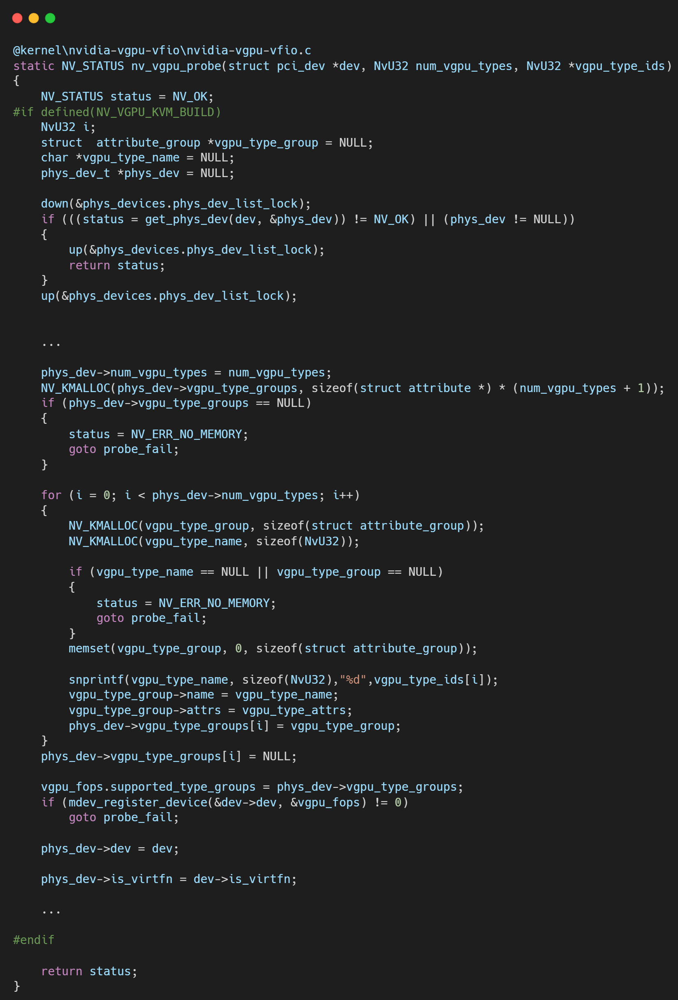
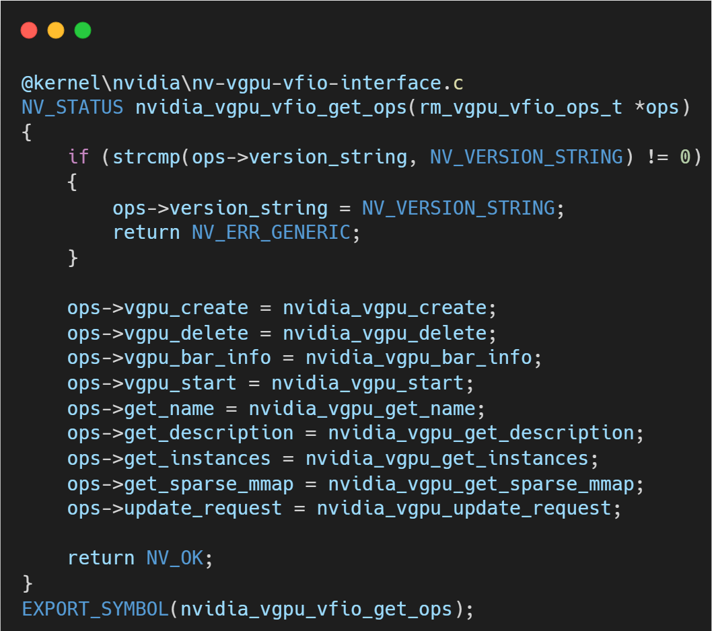
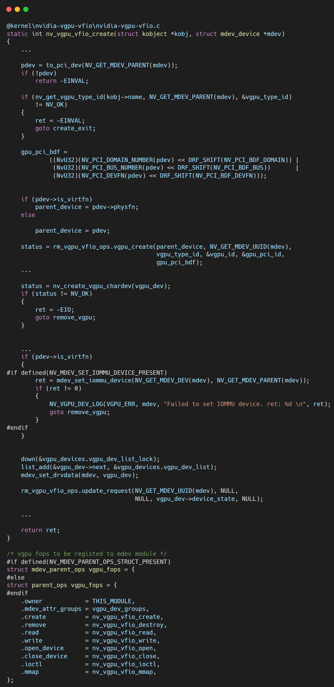

# VFIO框架源码分析（六）- NVIDIA vGPU驱动剖析（上）：前端-后端架构与初始化

## 引言与整体框架

NVIDIA vGPU技术是数据中心GPU虚拟化的行业标杆，它允许将单块物理GPU的强大能力“分割”并同时赋能给多个虚拟机。`nvidia-vgpu-vfio` 内核模块是实现这一魔法的关键组件，它扮演着连接NVIDIA专有GPU驱动与Linux标准VFIO/MDEV虚拟化框架的“适配器”角色。

本文（上篇）将基于NVIDIA-Linux-x86_64-460.73.01-grid-vgpu-kvm版本，深入分析`nvidia-vgpu-vfio`驱动的顶层设计，重点解读其精妙的“前端-后端”解耦架构，以及在模块初始化和探测（Probe）阶段，它是如何与NVIDIA核心驱动建立通信、并向Linux内核注册自身虚拟化能力的。

**核心分析：解耦的“前端-后端”架构**

`nvidia-vgpu-vfio`驱动最核心的设计思想就是解耦。它将自身定位为一个轻量级的“前端”，负责处理所有与内核MDEV/VFIO框架相关的标准化交互，而将所有复杂、专有的GPU虚拟化逻辑交由一个强大的“后端”——即NVIDIA的核心资源管理器（Resource Manager, RM）来处理。这两者之间的通信桥梁是一套定义清晰的操作函数集（Operations）。

模块的入口函数`nv_vgpu_vfio_init`完美地体现了这一点。它主要执行两个关键动作：

1.  **建立与后端的通信 (`nvidia_vgpu_vfio_set_ops`)**: 前端驱动调用此函数，并传入一个空的`vgpu_vfio_ops`结构体指针。后端驱动（即`open-gpu-kernel-modules`中的实现）会填充这个结构体，将自己实现的一系列核心功能函数（如`vgpu_create`、`vgpu_delete`等）的地址赋值给它。这一步完成后，前端就拥有了一张可以指挥后端的“API列表”。

2.  **向内核注册自身 (`nv_vgpu_probe`)**: 建立通信后，驱动开始与内核交互。当物理GPU被`nvidia`主驱动探测到时，`nv_vgpu_probe`会被调用，它的核心任务是调用`mdev_register_device`，正式向MDEV框架“宣告”：这块物理GPU支持虚拟化，并指定了`vgpu_fops`作为管理其虚拟设备（即vGPU实例）的操作接口。

## **分步详解：初始化与能力注册**

**1. 后端接口的获取 (`nvidia_vgpu_vfio_set_ops`)**

这是整个驱动架构的基石。前端通过`nvidia_vgpu_vfio_get_ops`从后端获取了一系列函数指针。这些函数构成了前端操作vGPU所需的所有原语，例如：

*   `vgpu_create`: 请求后端创建一个vGPU实例。
*   `vgpu_delete`: 请求后端销毁一个vGPU实例。
*   `vgpu_bar_info`: 获取vGPU虚拟BAR空间的信息。
*   `vgpu_get_name`, `get_description`, `get_instances`: 查询特定vGPU类型的元数据，这些信息会被展示在`sysfs`中，供管理员查看和选择。

所有这些函数的具体实现，都位于`open-gpu-kernel-modules`驱动中。这种设计使得VFIO适配层（前端）可以保持相对稳定，而NVIDIA可以独立地在后端迭代其复杂的GPU虚拟化技术。

**2. MDEV父设备的注册 (`nv_vgpu_probe`)**

当GPU物理设备准备就绪时，`nv_vgpu_probe`函数会被执行，它负责将GPU注册为一个可以承载MDEV虚拟设备的“母体”。

*   **调用 `mdev_register_device`**: 这是向MDEV框架注册的核心调用。
*   **传递 `vgpu_fops`**: 在注册时，驱动传递了`vgpu_fops`这个关键的结构体。`vgpu_fops`定义了当用户通过`sysfs`对这个父设备进行操作时，内核应该调用哪些函数。例如，当用户执行`echo $UUID > create`命令时，MDEV框架就会调用`vgpu_fops`中指定的`.create`函数。

至此，`nvidia-vgpu-vfio`驱动的初始化和注册流程全部完成。它成功地搭建了与后端核心驱动的通信桥梁，并以一个标准MDEV父设备的面貌融入了Linux内核。

## 总结

NVIDIA vGPU驱动向我们展示了一个工业级驱动的优雅设计：

1.  **清晰的职责分离**: `nvidia-vgpu-vfio`作为前端，专注于适配Linux内核接口；NVIDIA RM作为后端，专注于实现核心虚拟化逻辑。
2.  **接口驱动的设计**: 通过一套标准的操作函数集`ops`进行通信，实现了前后端的完美解耦，提高了代码的可维护性和扩展性。
3.  **标准化的集成**: 严格遵循MDEV框架的要求，通过`mdev_register_device`将自身注册为一个标准的父设备，为后续创建和管理vGPU实例铺平了道路。

在下一篇文章中，我们将深入`vgpu_fops`的内部，探究一个vGPU实例从创建、被虚拟机使用到最终销毁的完整生命周期。

## 关于作者

大家好，我是宝爷，浙大本科、前华为工程师、现某芯片公司系统架构负责人，关注个人成长。

新的图解文章都在公众号「宝爷说」首发，别忘记关注了哦！

感谢你读到这里。

如果这篇文章对您有所帮助，欢迎点赞、分享或收藏！你的支持是我创作的动力！

如果您不想错过未来的更新，记得点个星标 ⭐，下次我更新你就能第一时间收到推送啦。
