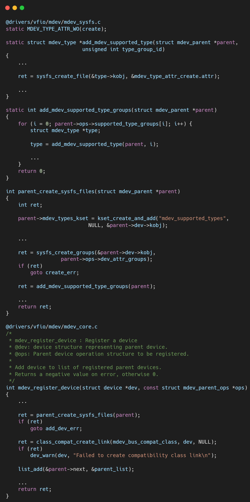

# VFIO框架源码分析（四）- VFIO-MDEV设备虚拟化的新篇章

## 引言与整体框架

我们之前讨论的 `vfio-pci` 实现了设备的物理直通，它功能强大但存在一个核心限制：独占性。一个物理设备一旦被分配给一个虚拟机，其他虚拟机或宿主机便无法再使用它。为了解决这一问题，内核引入了`MDEV`（Mediated Device）框架。`MDEV` 是一种设备虚拟化技术，允许一个物理设备（Parent Device）被“分割”成多个独立的虚拟设备（Mediated Devices），这些虚拟设备可以被独立地分配给不同的虚拟机，从而实现单张物理卡（如GPU、FPGA）的多用户共享。

`vfio-mdev` 模块正是连接通用 `MDEV` 框架与 VFIO 体系的桥梁。本文将深入解析`MDEV`的核心机制以及 `vfio-mdev` 驱动如何将一个被虚拟出来的 `mdev` 设备封装成标准的 `vfio_device`，最终呈现给用户空间。

**核心分析：MDEV框架与VFIO驱动的双层结构**

`vfio-mdev` 的实现依赖于两个协同工作的核心组件：通用的 `MDEV` 框架和专用的 `vfio-mdev` 驱动。

1.  **MDEV核心框架 (`mdev_init`)**:
    此框架独立于VFIO，提供了一套通用的、用于创建和管理虚拟设备的基础设施。它的初始化过程主要完成：
    *   **注册MDEV总线 (`mdev_bus_register`)**: 创建一个名为 `mdev` 的新总线类型。所有通过 `MDEV` 框架创建的虚拟设备都将挂载在这条总线上。
    *   **注册VFIO的MDEV驱动 (`mdev_register_driver`)**: 将 `vfio_mdev_driver` 注册到内核中。这个驱动的作用就是等待并绑定到任何出现在 `mdev` 总线上的新设备。

2.  **物理设备驱动的集成 (`mdev_register_device`)**:
    `MDEV` 框架本身不创造虚拟设备，它需要物理设备驱动（如Intel的 `i915` GVT-g驱动）主动注册其虚拟化的能力。
    *   物理驱动调用 `mdev_register_device` 来声明它支持创建 `mdev`。
    *   这一调用会通过 `parent_create_sysfs_files` 在该物理设备的 `sysfs` 目录下创建 `mdev_supported_types` 目录。
    *   目录下包含了该物理设备支持创建的 `mdev` 类型（例如 `i915-GVTg_V5_4`），每种类型下都有一个名为 `create` 的 `sysfs` 属性文件。用户空间正是通过向这个`create`文件写入一个UUID来动态创建一个`mdev`实例。

## 分步详解：从Sysfs创建到VFIO设备

### **第一步：MDEV设备的诞生 (`create_store`)**

当用户在 `sysfs` 中向特定类型的 `create` 文件写入一个UUID时，内核会调用其回调函数 `create_store`。
*   `create_store` 内部调用 `mdev_device_create`。
*   `mdev_device_create` 函数会：
    1.  调用物理设备驱动提供的 `.create` 回调函数，由物理驱动负责分配和初始化代表虚拟设备的内部数据结构。
    2.  创建一个标准的 `device` 结构体，并将其注册到前文提到的 `mdev` 总线上。

### **第二步：VFIO驱动的探测与绑定 (`vfio_mdev_probe`)**

一旦新的 `mdev` 设备出现在 `mdev` 总线上，总线核心会自动为其寻找匹配的驱动。由于 `vfio_mdev_driver` 是注册在该总线上的驱动，其 `.probe` 函数 `vfio_mdev_probe` 将被执行。
*   `vfio_mdev_probe` 是连接 `MDEV` 和 VFIO 的关键枢纽。
*   它调用 `vfio_init_group_dev`，这是一个我们熟悉的函数（在`vfio-pci`分析中也见过），它的作用是为这个 `mdev` 设备创建一个对应的 `vfio_group_dev`（即`vfio_device`）。
*   在初始化过程中，它将 `vfio_mdev_dev_ops` 这套操作函数集与新创建的 `vfio_device` 关联起来。
*   这一步的逻辑与物理设备被 `vfio-pci` 绑定时的流程高度相似，最终都产出了一个标准的、可被VFIO核心层管理的 `vfio_device`。

### **第三步：代理模式 (`vfio_mdev_dev_ops`)**

`vfio_mdev_dev_ops` 的实现揭示了 `vfio-mdev` 模块设计的精髓——代理模式（Proxy Pattern）。`vfio-mdev` 自身不实现任何复杂的设备访问逻辑，它只是一个“中间人”或“转发器”。

当用户空间对最终获得的 `vfio_device` fd进行 `open`, `read`, `write`, `ioctl` 等操作时，会触发 `vfio_mdev_dev_ops` 中对应的函数：
*   例如，调用 `vfio_mdev_open_device` 时，它会首先从 `vfio_device` 找到其背后的 `mdev` 设备，再通过 `mdev` 找到创建它的物理设备驱动（`parent`）。
*   然后，它直接调用 `parent->ops->open_device`，将操作请求原封不动地转发给物理设备驱动。
*   对于 `read`, `write`, `ioctl` 等所有其他操作，`vfio-mdev` 都采用完全相同的模式进行转发。

这意味着，所有关于设备资源虚拟化、多用户隔离、状态保存与恢复等复杂工作，全部由底层的物理设备驱动（如 `i915`, `nvidia`）来完成。`vfio-mdev` 只负责提供标准的VFIO接口封装。

## 总结

`MDEV` 框架与 `vfio-mdev` 驱动共同构建了一个优雅、解耦的设备虚拟化体系：

1.  **通用框架层 (`MDEV`)**: 提供了一套标准的、通过 `sysfs` 创建和管理虚拟设备的机制，与具体总线和驱动无关。
2.  **能力提供层 (物理驱动)**: 真正的物理设备驱动（如Intel GVT-g）负责实现资源切分和虚拟化的核心逻辑，并通过 `mdev_register_device` 向 `MDEV` 框架“宣告”自己的能力。
3.  **VFIO适配层 (`vfio-mdev`)**: 作为一个“胶水”驱动，它自动探测由用户创建的 `mdev` 实例，将其无缝地包装成一个标准的 `vfio_device`，并以代理模式将所有设备操作请求转发给底层的物理驱动。

这种分层设计极大地简化了设备虚拟化的集成工作。任何硬件厂商只要实现其物理驱动对 `MDEV` 接口的支持，就能立即利用 `vfio-mdev` 模块，将其设备共享能力接入到成熟、健壮的VFIO生态中，供QEMU等用户空间程序使用。

## 关于作者

大家好，我是宝爷，浙大本科、前华为工程师、现某芯片公司系统架构负责人，关注个人成长。

新的图解文章都在公众号「宝爷说」首发，别忘记关注了哦！

感谢你读到这里。

如果这篇文章对您有所帮助，欢迎点赞、分享或收藏！你的支持是我创作的动力！

如果您不想错过未来的更新，记得点个星标 ⭐，下次我更新你就能第一时间收到推送啦。