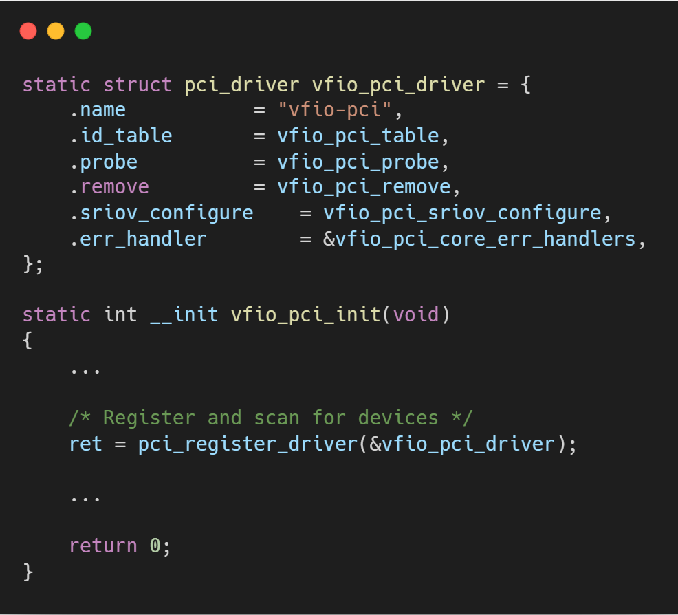
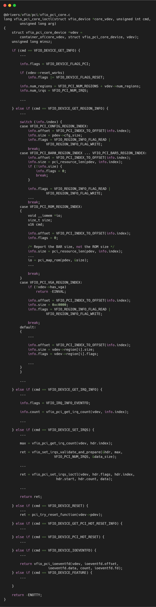

# VFIO框架源码分析（二）- PCI设备的生命周期管理

## 引言与整体框架

在上一篇文章中，我们分析了VFIO的核心框架层，它定义了一套通用的、层次化的设备管理模型（Container -> Group -> Device）。然而，这个核心层是与具体总线无关的。为了管理真实世界中的设备，VFIO需要针对特定总线的驱动程序来实现其定义的 `vfio_device_ops` 接口。`vfio-pci` 就是这一理念下最重要的实现，它专门负责管理PCI/PCIe设备，是实现设备直通的关键工作模块。

本文将深入解析 `vfio-pci` 驱动的内部工作机制，从一个PCI设备如何被该驱动“捕获”，到用户空间（如QEMU）如何通过 `vfio_pci_ops` 接口查询设备信息、配置中断、并最终实现高性能的I/O访问。

**核心分析：`vfio_pci_init` 与驱动绑定**

`vfio-pci` 作为一个标准的PCI驱动程序，其入口点是 `vfio_pci_init` 函数。此函数的核心任务是向Linux内核的PCI子系统注册一个 `pci_driver` 结构体，即 `vfio_pci_driver`。

当用户通过 `sysfs` 将一个PCI设备从其原始驱动解绑，并绑定到 `vfio-pci` 驱动时，PCI核心会调用 `vfio_pci_driver` 中注册的 `.probe` 回调函数——`vfio_pci_probe`。此函数是设备生命周期的起点，负责将一个物理PCI设备转化为VFIO框架可识别和管理的 `vfio_device`。

`vfio_pci_probe` 的关键步骤如下：
1.  **初始化设备操作集**: 在 `vfio_pci_core_init_device` 函数中，将 `vfio_pci_ops` 这个包含了所有PCI设备具体操作的函数指针集，赋值给 `vfio_device` 结构。自此，来自VFIO核心层的通用设备操作请求，就能准确地路由到 `vfio-pci` 的具体实现中。
2.  **创建并注册VFIO Device**: 这是最核心的一步。它会创建一个 `vfio_device` 实例，并通过 `vfio_pci_core_register_device` 将其与物理设备关联起来，并挂载到上一步获取的 `vfio_group` 中。

## 分步详解：`vfio_pci_ops` 的实现

`vfio_pci_ops` 是连接VFIO核心与PCI物理设备的桥梁，它实现了用户空间对设备进行完整控制所需的所有接口。

### **设备打开与初始化 (`open_device`)**

当用户空间通过 `VFIO_GROUP_GET_DEVICE_FD` ioctl 第一次打开设备时，`vfio_pci_open_device` 函数会被调用。它会触发 `vfio_pci_core_enable`，执行关键的设备初始化操作：
*   `pci_enable_device`: 激活设备，为其分配资源。
*   `pci_try_reset_function`: 尝试对设备执行Function-Level Reset (FLR)，使其处于一个干净的初始状态。
*   `vfio_config_init`: 读取设备的PCI配置空间，并将其完整内容缓存到内核内存中（`vdev->vconfig`）。这一步至关重要，因为它为后续模拟和虚拟化配置空间访问提供了基础。

### **核心控制接口 (`ioctl`)**

`ioctl` 是用户空间对设备进行配置和管理的主要手段，由 `vfio_pci_core_ioctl` 函数处理。

*   **资源发现**:
    *   `VFIO_DEVICE_GET_INFO`: 获取设备信息，如它拥有的Region数量和IRQ数量。
    *   `VFIO_DEVICE_GET_REGION_INFO`: 获取特定Region（如Config Space、BAR0-5、Expansion ROM）的详细信息，包括偏移、大小、标志位等。
    *   `VFIO_DEVICE_GET_IRQ_INFO`: 获取设备支持的中断类型（INTx, MSI, MSI-X）及其数量。
    QEMU等VMM利用这些接口来探测和理解物理设备的布局，以便在虚拟机中模拟出一个相同的虚拟设备。

*   **中断配置 (`VFIO_DEVICE_SET_IRQS`)**:

    这是 `ioctl` 中最复杂但也是最核心的功能，它允许用户空间精细地控制设备的中断行为。其核心是实现了基于 **eventfd** 的中断通知机制。
    1.  用户空间创建一个或多个 `eventfd` 文件描述符。
    2.  通过 `VFIO_DEVICE_SET_IRQS` ioctl，并使用 `VFIO_IRQ_SET_DATA_EVENTFD` 标志，将这些 `eventfd` 与设备的特定硬件中断向量关联起来。
    3.  `vfio-pci` 内核驱动收到请求后，会向PCIe子系统申请中断资源（`pci_alloc_irq_vectors`）。
    4.  然后，它调用 `request_irq` 注册一个内核中断处理函数（如 `vfio_msihandler`）。
    5.  当物理设备产生硬件中断时，内核的 `vfio_msihandler` 会被触发。该处理函数的核心任务就是向用户空间传递的 `eventfd` 发送一个信号。
    6.  在用户空间，一个等待该 `eventfd` 的线程（如QEMU的I/O线程）会被唤醒。该线程随后可以将这个中断注入到Guest VM中。
    如思维导图所述，这一机制完美实现了**“注册中断以及回调函数，用于向VM里注入中断”**的目的。

### **数据通路：内存映射与I/O (`mmap`, `read`, `write`)**

这些接口构成了设备访问的数据平面。

*   **`mmap`**: 这是实现高性能MMIO（Memory-Mapped I/O）访问的关键。用户空间可以通过 `mmap` 系统调用，将设备的BAR空间直接映射到自己的虚拟地址空间。`vfio_pci_core_mmap` 会设置相应的VMA操作集（`vma->vm_ops = &vfio_pci_mmap_ops`），使得用户空间的读写操作可以绕过内核，像访问普通内存一样直接访问设备硬件，从而获得极高的性能。

*   **`read`/`write`**: 对于无法或不适合 `mmap` 的区域（最典型的就是PCI配置空间），用户空间可以通过 `read` 和 `write` 系统调用来访问。`vfio_pci_core_read/write` 内部通过 `vfio_pci_rw` 函数，根据用户指定的Region索引，将请求分发到不同的处理函数：
    *   `VFIO_PCI_CONFIG_REGION_INDEX`: 访问PCI配置空间，由 `vfio_pci_config_rw` 处理，它会访问之前缓存的 `vconfig`，实现了对配置空间的虚拟化访问。
    *   `VFIO_PCI_BARx_REGION_INDEX`: 访问设备的MMIO或PIO空间，由 `vfio_pci_bar_rw` 处理。
    *   `VFIO_PCI_ROM_REGION_INDEX`: 访问Option ROM。

## 总结

`vfio-pci` 驱动是VFIO框架的具体实现典范。它作为PCI总线的“代理人”，完美地执行了以下职责：
1.  **设备生命周期管理**: 通过标准的 `pci_driver` 接口，在设备绑定时完成初始化，并将其纳入VFIO的管理体系。
2.  **资源抽象与发现**: 通过一系列 `ioctl` 接口，将物理PCI设备的复杂资源（Region、IRQ）以标准化的方式呈现给用户空间。
3.  **高性能数据通路**: 利用 `mmap` 技术为设备的BAR空间提供了近乎裸金属性能的访问能力。
4.  **灵活的中断虚拟化**: 开创性地使用 `eventfd` 机制，构建了一条从硬件中断到用户空间通知的高效、灵活的通道，完美解决了中断注入虚拟机的难题。

综上所述，`vfio-pci` 不仅仅是一个驱动，更是现代虚拟化技术实现高性能、安全设备直通的核心基石。

## 关于作者

大家好，我是宝爷，浙大本科、前华为工程师、现某芯片公司系统架构负责人，关注个人成长。

新的图解文章都在公众号「宝爷说」首发，别忘记关注了哦！

感谢你读到这里。

如果这篇文章对您有所帮助，欢迎点赞、分享或收藏！你的支持是我创作的动力！

如果您不想错过未来的更新，记得点个星标 ⭐，下次我更新你就能第一时间收到推送啦。
