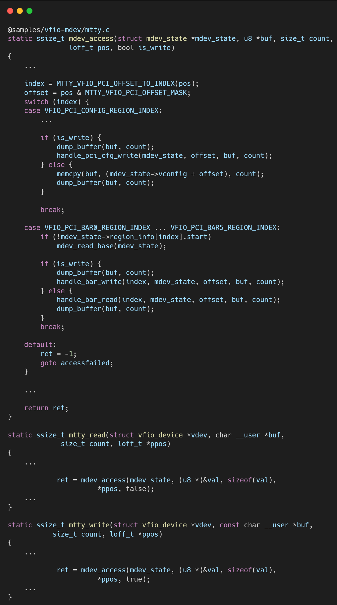

# VFIO框架源码分析（五）- MDEV驱动实现剖析：以mtty示例驱动为蓝本

## 引言与整体框架

在前文对 `vfio-mdev` 框架的分析中，我们了解到它是一个通用的“胶水层”，负责将任何 `mdev` (Mediated Device) 虚拟设备适配到 VFIO 体系中。然而，`vfio-mdev` 自身并不创造虚拟设备，这一职责落在了底层的物理设备驱动身上。`mtty` (Mediated TTY) 正是内核源码中提供的一个官方示例，它完整地展示了一个物理驱动（尽管它本身也是虚拟的）如何实现 `MDEV` 接口，从而将其“硬件”资源分割给多个用户。

`mtty` 模拟了一个可以被虚拟化的多端口 TTY 设备。通过分析其源码，我们可以清晰地理解一个 MDEV 父驱动（Parent Driver）需要承担的全部职责：从向内核注册虚拟化能力，到管理虚拟设备生命周期，再到最终为每个虚拟设备实现具体的 I/O 模拟。

**核心分析：mtty驱动的双重角色**

`mtty` 驱动的初始化函数 `mtty_dev_init` 揭示了其设计的核心——它同时扮演了两个关键角色：

1.  **MDEV父设备驱动**: 通过调用 `mdev_register_device`，`mtty` 将自己注册为一个可以被虚拟化的父设备。
    *   它传递了 `mdev_fops` 结构体，其中定义了创建和销毁 `mdev` 实例时的核心回调函数（`.probe = mtty_probe`）。
    *   它还定义了 `mdev_type_groups`，通过 `sysfs` 向用户空间暴露出它支持创建的 `mdev` 类型（例如，名为 "1" 和 "2" 的两种类型），以及每种类型的可用实例数量等信息。

2.  **MDEV设备驱动**: 通过调用 `mdev_register_driver`，`mtty` 也注册了一个标准的 `device_driver`。这个驱动（`mtty_driver`）的作用是绑定到由 `mtty` 自己创建的 `mdev` 虚拟设备上。这是一个自包含的设计，即 `mtty` 不仅是 `mdev` 的“生产者”，也是这些 `mdev` 的“管理者”。

## 分步详解：一个mtty虚拟设备的生命周期

### **第一步：MDEV实例的创建与探测 (`mtty_probe`)**

当用户通过 `sysfs` 接口请求创建一个 `mtty` 类型的 `mdev` 设备时，MDEV核心框架会调用 `mtty_fops` 中注册的 `.probe` 回调函数，即 `mtty_probe`。此函数是虚拟设备生命周期的起点。

*   **资源管理**: `mtty_probe` 首先会检查父设备是否还有足够资源来创建新的虚拟设备。它以原子方式检查并减少可用端口数 `avail_ports`，如果资源不足则创建失败。这模拟了真实硬件驱动管理虚拟功能（VF）资源的过程。
*   **VFIO设备封装**: 资源检查通过后，`mtty_probe` 会为这个新的 `mdev` 实例创建一个状态保持结构 (`mdev_state`)。接着，它调用 `vfio_init_group_dev` 函数，将这个 `mdev` 设备封装成一个标准的 `vfio_device`，并把 `mtty_dev_ops` 作为其操作函数集。
*   **设备模拟初始化**: 最后，它调用 `mtty_create_config_space` 来初始化一块内存，用于模拟该虚拟设备的PCI配置空间，并存放在 `mdev_state->vconfig` 中。

### **第二步：I/O模拟与VFIO接口实现 (`mtty_dev_ops`)**

一旦 `mdev` 被封装成 `vfio_device` 并传递给用户空间（如QEMU），用户空间便会通过标准的VFIO接口（`read`, `write`, `ioctl`）与其交互。这些操作最终都由 `mtty_dev_ops` 中的函数来处理，从而实现了设备行为的完整模拟。

*   **`read`/`write` 操作**: 由 `mtty_read` 和 `mtty_write` 函数处理。
    *   当访问 `VFIO_PCI_CONFIG_REGION_INDEX` 时，驱动直接对 `mdev_state->vconfig` 这块内存进行读写。这向用户空间提供了一个完全虚拟的、行为一致的PCI配置空间。
    *   当访问 `VFIO_PCI_BARx_REGION_INDEX` 时，驱动通过 `handle_bar_read/write` 函数，读写 `mdev_state` 中的另一块模拟内存区域（`mdev_state->s[index]`）。这模拟了对设备MMIO Bar空间的访问。

*   **`ioctl` 操作**: 由 `mtty_ioctl` 函数处理。它实现了如 `VFIO_DEVICE_GET_INFO` 等一系列标准的VFIO `ioctl` 命令，向用户空间报告这个模拟设备的各种元数据（Region信息、中断信息等），使其看起来和一个真实的PCI设备别无二致。

## 总结

`mtty` 驱动以一个简洁而完整的方式，为我们提供了一个实现 MDEV 父驱动的完美范例。它清晰地展示了成为一个合格的 MDEV 父驱动所需的核心要素：

1.  **能力注册**: 必须通过 `mdev_register_device` 向 MDEV 核心注册自己，并定义可供创建的虚拟设备类型。
2.  **生命周期管理**: 必须实现 `.probe` 和 `.remove` 等回调函数，在其中处理虚拟设备的创建和销毁，包括关键的父设备资源管理。
3.  **VFIO接口适配**: 必须为创建的 `mdev` 实例提供一套 `vfio_device_ops` 实现，将VFIO的标准化操作（如访问配置空间、BAR空间）转化为对内部模拟状态的读写。
4.  **状态虚拟化**: 必须为每个 `mdev` 实例维护一个独立的状态（`mdev_state`），包含了模拟设备所需的所有信息，如虚拟配置空间、虚拟BAR区等，从而实现多实例间的隔离。

`mtty` 的存在，极大地降低了硬件厂商开发支持 SR-IOV 或其他类型设备共享技术的驱动的门槛，它是一个功能完备、可供参考和模仿的“活文档”。

## 关于作者

大家好，我是宝爷，浙大本科、前华为工程师、现某芯片公司系统架构负责人，关注个人成长。

新的图解文章都在公众号「宝爷说」首发，别忘记关注了哦！

感谢你读到这里。

如果这篇文章对您有所帮助，欢迎点赞、分享或收藏！你的支持是我创作的动力！

如果您不想错过未来的更新，记得点个星标 ⭐，下次我更新你就能第一时间收到推送啦。