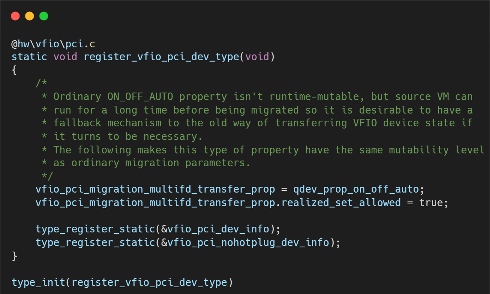

# VFIO框架源码分析（八）- QEMU VFIO-PCI 设备类型的注册与初始化深度解析

## 简介与背景

在虚拟化技术中，PCI 设备直通（Passthrough）是实现高性能 I/O 的关键技术。QEMU 作为用户态的虚拟机监控器（VMM），通过 VFIO（Virtual Function I/O）子系统与 Linux 内核交互，将物理设备的控制权安全地暴露给虚拟机。

然而，在 QEMU 真正打开 /dev/vfio 设备文件之前，它必须先在自身的对象模型（QOM, QEMU Object Model）中“注册”这一设备类型。这一步看似简单，实则是定义设备生命周期（创建、复位、迁移、销毁）的基石。

本文将基于qemu v10.0.3版本，深入解析 VFIO-PCI 设备的“出生证明”。

## 核心入口：type_init 与 QOM 机制

QEMU 的启动过程是一个巨大的模块加载过程。

type_init 是一个宏，它利用 GCC 的 __attribute__((constructor)) 特性，确保 register_vfio_pci_dev_type 函数在 main 函数执行前被调用。

这意味着，无论用户是否在命令行中指定了 -device vfio-pci，只要编译了该模块，VFIO-PCI 的类型定义就已经存在于 QEMU 的全局类型哈希表中了。

## 逐层代码拆解：从类（Class）到实例（Instance）

### 类型定义的奥秘 (vfio_pci_dev_info)

结构体 vfio_pci_dev_info 包含几个关键字段：

**.parent = TYPE_PCI_DEVICE**: 

这表明 VFIO-PCI 本质上是一个 PCI 设备。它继承了 PCI 设备的所有通用属性（如 Bus/Slot/Function 寻址、配置空间管理）。

这使得 VFIO 设备可以无缝插入到 QEMU 模拟的 PCI 总线拓扑中。

**.instance_size = sizeof(VFIOPCIDevice)**: 

告诉 QOM 当创建一个新对象时，需要分配多大的内存。VFIOPCIDevice 不仅包含标准的 PCIDevice 结构，还包含了 VFIO 特有的字段（如 vbasedev 用于存 fd，msix 用于存中断状态）。

### 类初始化 (vfio_pci_dev_class_init)

当 QEMU 第一次需要该类型的对象时，会调用类初始化函数。这里主要配置虚函数表，决定了设备的行为模式。

**复位回调 (device_class_set_legacy_reset)**:

绑定 vfio_pci_reset。这是虚拟机重置或设备 FLR（Function Level Reset）时执行的逻辑。它确保硬件在交给 Guest 重新使用前处于干净状态。

**生命周期核心 (realize)**:

设置 pdc->realize = vfio_realize。这是设备“实例化”的最关键函数。当用户在该设备上调用 device_add 时，QEMU 最终会执行这个函数。它负责打开内核文件、映射 BAR 空间等实质性操作。

**退出清理 (exit)**:

设置 pdc->exit = vfio_exitfn。用于热拔出或虚拟机关闭时的资源释放，防止 fd 泄漏。

### 实例初始化 (vfio_instance_init)

每当创建一个新的 VFIO 设备对象（object_new），都会执行此函数。

**初始化基础结构**: 

调用 vfio_device_init，初始化 vbasedev 结构体。此时不会打开 /dev/vfio，只是在内存中准备好数据结构。

**配置属性**: 

设置设备的 bootindex 等属性，允许用户通过命令行配置启动优先级。

## 总结

register_vfio_pci_dev_type 及其关联的初始化函数，展示了 QEMU 面向对象的设计哲学。

VFIO-PCI 设备首先作为一个标准的“软件对象”被注册，通过继承 TYPE_PCI_DEVICE 获得通用能力，并通过覆写 realize 和 reset 方法注入 VFIO 特有的硬件直通逻辑。

这一阶段虽然不涉及内核交互，但定义了设备“是什么”以及“怎么做”，为后续的硬件接管铺平了道路。

## 关于作者

大家好，我是宝爷，浙大本科、前华为工程师、现某芯片公司系统架构负责人，关注个人成长。

新的图解文章都在公众号「宝爷说」首发，别忘记关注了哦！

感谢你读到这里。

如果这篇文章对您有所帮助，欢迎点赞、分享或收藏！你的支持是我创作的动力！

如果您不想错过未来的更新，记得点个星标 ⭐，下次我更新你就能第一时间收到推送啦。