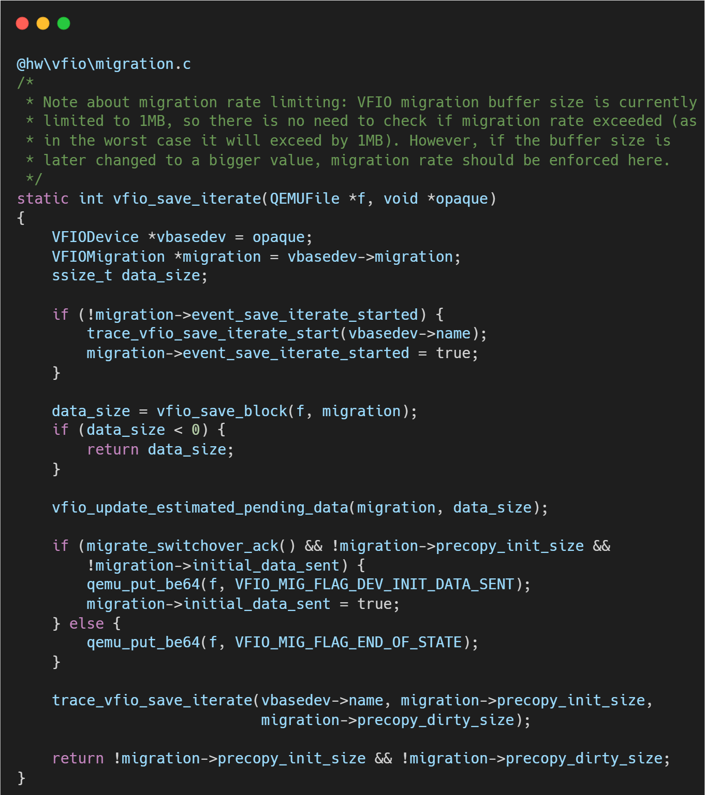
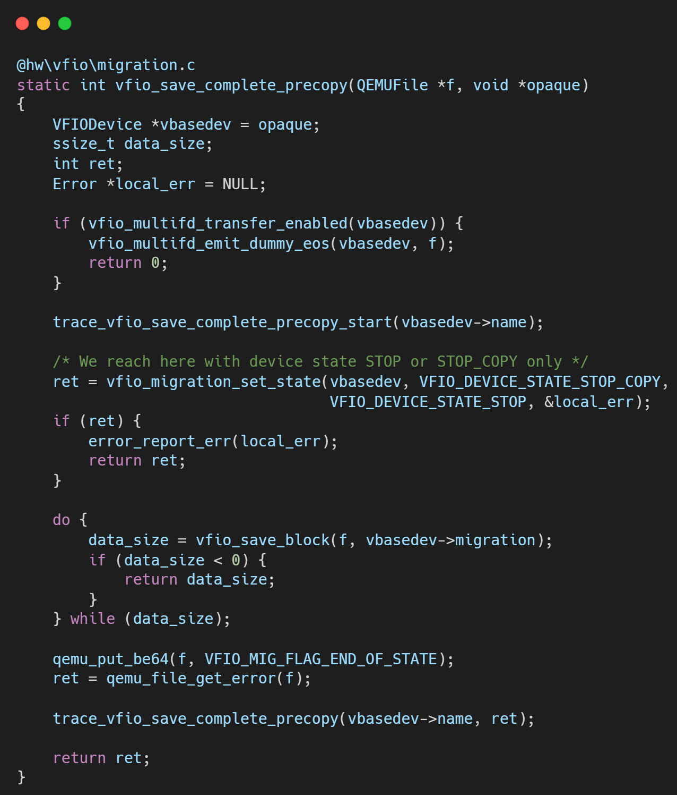
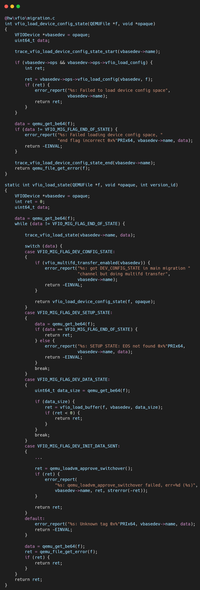

# VFIO框架源码分析（十一）- QEMU VFIO 实时迁移 (Live Migration) 架构深度解析

## 一、 背景与核心挑战

在虚拟化场景下，设备的**实时迁移 (Live Migration)** 一直是“直通设备 (Passthrough Device)”的阿喀琉斯之踵。

*   **纯模拟设备 (Virtio)**：状态完全在内存中（QEMU 进程内），迁移就是简单的内存拷贝。

*   **直通设备 (VFIO)**：设备状态散落在硬件内部的寄存器、SRAM、甚至是正在处理的 Pipeline 中。对 Hypervisor (QEMU) 来说，这是一个**黑盒**。

随着云原生架构对弹性伸缩的需求，Linux 内核与 QEMU 引入了 VFIO Migration 协议。其核心思想是：**打破黑盒，定义标准 ABI，让硬件驱动（Vendor Driver）主动将内部状态“序列化”为字节流，通过 QEMU 搬运到目标机，再“反序列化”恢复。**

本文基于 QEMU 源码与 Linux VFIO Migration v2 协议（Linux 6.0+），深度解析这一过程。

## 二、 核心架构：控制流与数据流

VFIO 迁移架构并非单纯的代码逻辑，而是一套严格的 **State Machine（状态机）** 和 **Data Pipeline（数据管道）**。

核心结构体定义在 `hw/vfio/migration.c` 和内核头文件 `include/uapi/linux/vfio.h` 中。

### 1. 控制面：状态机 (State Machine)
QEMU 不懂硬件细节，它只负责通过 `ioctl(VFIO_DEVICE_FEATURE)` 控制设备的状态流转。在 v2 协议中，主要状态包括：

*   **RUNNING**: 设备正常工作，DMA 开启。
*   **PRE_COPY**: 设备在运行，但驱动开始导出内部状态（迭代阶段）。
*   **STOP_COPY**: 设备停止运行（DMA 暂停），驱动导出剩余的所有状态。
*   **RESUMING**: 目标机设备处于接收数据并恢复现场的状态。

### 2. 数据面：迁移缓冲区 (Migration Region)
这是 QEMU 与内核驱动交换数据的“窗口”。设备驱动在 BAR 空间或特定的 PCI Capability 中暴露一块 **Migration Region**。
*   **Device -> QEMU**: 驱动将硬件状态 dump 到这个 Region，QEMU 像读文件一样读走。
*   **QEMU -> Device**: QEMU 将数据写入 Region，驱动读取并恢复硬件。

## 三、 逐层代码拆解与生命周期分析

我们将代码逻辑按照迁移的生命周期重新串联：**初始化 -> 迭代传输 -> 停机切换 -> 恢复**。

### 1. 迁移初始化：`vfio_migration_realize`

这是迁移能力的探测阶段。

**关键点**：这里建立了 Userspace 和 Kernel 的共享内存通道。为了 SOTA 性能，这里通常采用 mmap 方式，避免数据搬运时的上下文切换。

### 2. 开启脏页追踪：Memory Dirty Tracking

迁移不仅要迁设备内部状态，还要迁设备 DMA 写入的系统内存。如果迁移过程中设备还在疯狂写内存，必须记录下来重传。

*   **QEMU 动作**: 调用 `vfio_memory_listener` 相关的 log_start。
*   **内核/硬件动作**:
    *   **IOMMU 硬件追踪** (Modern): 利用 IOMMU 的 Dirty Bit 功能，性能开销极小。
    *   **软件追踪** (Legacy): 驱动强制将 IOVA 设为只读，触发 IOMMU Page Fault 来捕获写操作（性能较差）。
*   **交互**: 在迭代阶段，QEMU 定期调用 `ioctl(VFIO_IOMMU_DIRTY_PAGES)` 或查询 `IOMMUFD` 获取位图。

### 3. 迭代传输阶段：`vfio_save_iterate` (Pre-Copy)

这是虚拟机仍在运行时的“热传输”阶段。目标是尽可能把静态数据先搬过去，减小最后停机的时间窗口。

在这个阶段，芯片驱动利用硬件的空闲时间（Overlap）整理状态，尽量不要阻塞主要的推理任务。

### 4. 停机与最终传输：`vfio_save_complete_precopy` (Stop-and-Copy)

这是迁移最关键的时刻，虚拟机 CPU 停止运行。

### 5. 目标端恢复：`vfio_load_state`

目标机接收数据流，就像“回放”录像一样。

*   **写入数据**: QEMU 循环读取迁移流，写入目标设备的 Migration Region。
*   **驱动处理**: 驱动收到数据后，解析并恢复硬件内部状态。
*   **最终激活**: 当所有数据加载完毕，QEMU 将设备状态切换为 **RESUMING -> RUNNING**。设备复活，继续执行中断的推理任务。

## 四、 深度总结与技术演进

VFIO 迁移框架的本质是将**硬件状态软件化**。

### 1. 架构优势

*   **解耦**: QEMU 不需要知道设备是 GPU 还是网卡，它只负责搬运 "Data Blob"。
*   **一致性**: 结合 IOMMU 脏页追踪，保证了 DMA 和 CPU 内存的一致性。

### 2. Linux的演进 (Linux 6.6+)

对于高性能 AI 芯片，当前的挑战在于**状态量巨大**（GB 级别的 HBM 上下文）。

*   **IOMMUFD**: Linux 6.6 引入的 `iommufd` 子系统进一步优化了脏页追踪的性能，支持硬件加速的位图上报。

*   **Switchdev 模式**: 支持 SR-IOV 的 VF 在 Hypervisor 不感知的情况下，通过 PF 驱动进行热迁移。

实现高效的 `save_live_iterate` 回调，在不影响 GPU 推理性能的前提下，利用 DMA 引擎并行导出状态，是达到 SOTA 迁移性能的关键。

## 关于作者

大家好，我是宝爷，浙大本科、前华为工程师、现某芯片公司系统架构负责人，关注个人成长。

新的图解文章都在公众号「宝爷说」首发，别忘记关注了哦！

感谢你读到这里。

如果这篇文章对您有所帮助，欢迎点赞、分享或收藏！你的支持是我创作的动力！

如果您不想错过未来的更新，记得点个星标 ⭐，下次我更新你就能第一时间收到推送啦。