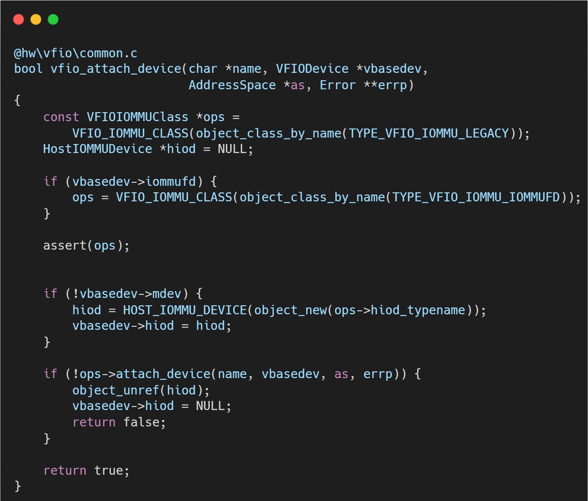
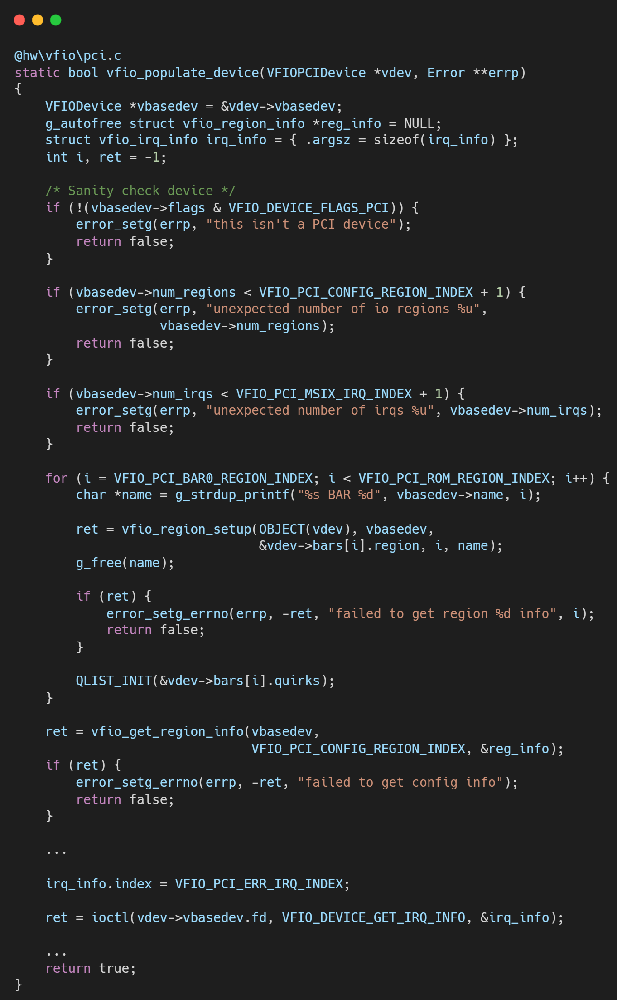

# VFIO框架源码分析（九）- VFIO-PCI 设备实例化 (Realize) 流程全解

## 简介与背景

当用户在启动参数中写下 -device vfio-pci,host=0000:01:00.0 时，QEMU 内部发生了一场复杂的“接力跑”。

vfio_realize 函数是将虚拟设备对象与物理硬件真正绑定的核心枢纽。

它不仅要打开设备文件，还要解析硬件资源（BAR、中断），并将其映射到虚拟机的地址空间中。
如果这一步失败，虚拟机将无法启动或无法看到该设备。

## 逐层代码拆解

vfio_realize位于 hw/vfio/pci.c，是 PCIDeviceClass 的 realize 方法实现。它的主要职责是：资源发现、资源映射、错误处理。

### 建立连接：vfio_attach_device

这是通往内核的第一道门。

**参数解析**: 函数首先解析 host 参数（如 0000:01:00.0），确定设备的 sysfs 路径。

**后端选择**: 根据 QEMU 的配置（是否启用 IOMMUFD），它会决定是走 Legacy 路径（打开 /dev/vfio/vfio）还是 IOMMUFD 路径（打开 /dev/iommu）。

**获取 Device FD**: 最终，vbasedev->fd 被赋值。这个文件描述符是后续所有 ioctl 操作的句柄。此时，QEMU 已持有硬件的控制权。

### 摸清家底：vfio_populate_device

有了 fd，QEMU 需要知道硬件的具体信息。

**Region 信息**: 调用 ioctl(fd, VFIO_DEVICE_GET_REGION_INFO)。这是一个循环过程，查询 Config Space、BAR0-BAR5、ROM 以及 VGA 区域的大小、偏移量和标志位（是否支持 mmap）。

**中断信息**: 调用 ioctl(fd, VFIO_DEVICE_GET_IRQ_INFO)，查询设备支持的中断类型（INTx, MSI, MSI-X）和向量数量。

### 虚拟化映射：vfio_bars_register

这是最关键的一步，决定了 Guest 读写设备寄存器时的性能。

**Fast Path (MMAP)**: 

如果内核报告某个 BAR 区域支持 mmap（通常是大多数非敏感的寄存器区域），QEMU 会调用 mmap 将物理设备的 BAR 空间直接映射到 QEMU 的虚拟地址空间。

然后通过 memory_region_init_ram_device_ptr 暴露给 Guest。Guest 访问这些地址时，CPU 直接指令直通硬件，性能极高。

**Slow Path (Trap)**: 

对于不支持 mmap 的区域（如某些有着副作用的寄存器或 Config Space），QEMU 使用 memory_region_init_io。Guest 的访问会触发 EPT Violation（内存缺页异常）。

陷入 KVM，再退回到 QEMU 的 vfio_region_read/write 回调中，最后由 QEMU 通过 pread/pwrite 系统调用访问硬件。

### 关联 IOMMU：pci_device_set_iommu_device

在虚拟化环境中，Guest 看到的物理地址（GPA）并不是真实的物理地址（HPA）。

此函数将 Host 端的 IOMMU 设备上下文（HostIOMMUDevice）关联到虚拟 PCI 设备上。

这对于 vIOMMU（Virtual IOMMU）场景尤为重要，它确保了当 Guest 开启 vIOMMU 时，QEMU 能正确查询宿主机 IOMMU 的能力（如支持的页表级数、最大地址宽度），从而向 Guest 报告正确的硬件能力。

## 总结

vfio_realize 是 QEMU VFIO 逻辑中最长、最复杂的函数之一。

它完成了一个从“虚”到“实”再到“虚”的过程：首先通过系统调用获取“实”际硬件的资源信息，然后通过内存映射技术构造出“虚”拟的 MemoryRegion 呈现给 Guest。

执行完这一步，Guest OS 就能在其 PCI 总线上扫描到该设备，并加载驱动程序，仿佛硬件直接插在虚拟主板上一样。

## 关于作者

大家好，我是宝爷，浙大本科、前华为工程师、现某芯片公司系统架构负责人，关注个人成长。

新的图解文章都在公众号「宝爷说」首发，别忘记关注了哦！

感谢你读到这里。

如果这篇文章对您有所帮助，欢迎点赞、分享或收藏！你的支持是我创作的动力！

如果您不想错过未来的更新，记得点个星标 ⭐，下次我更新你就能第一时间收到推送啦。