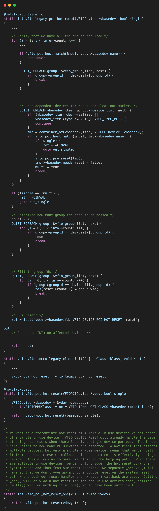

# VFIO框架源码分析（十二）- QEMU VFIO 设备复位策略 (Reset) 的多级保障

## 简介与背景

在虚拟化环境中，设备复位（Reset）不仅是功能需求，更是安全需求。

当虚拟机重启、崩溃或驱动卸载时，必须彻底清除设备内部的状态（如未完成的 DMA 请求、内部缓存），否则旧的数据可能会被 DMA 到新启动的 OS 内存中，造成严重的数据破坏或安全漏洞。

QEMU 的 VFIO 模块实现了一套复杂的多级复位策略，从轻量级的 FLR 到总线级的 Hot Reset，力求在成功率和副作用之间找到平衡。

## 逐层代码拆解

vfio_pci_reset此函数被注册为 QEMU Device Class 的 reset 回调。每当系统需要复位该设备时被触发。

### 预处理：vfio_pci_pre_reset

在真正动硬件之前，软件层面的清理必不可少。

**停止 DMA**: 

尝试清除 Bus Master Enable 位。

**关闭中断**: 

禁用 MSI/MSI-X，防止复位过程中产生虚假中断风暴。

**通知内核**: 

某些设备驱动可能需要知道设备即将复位，以便保存必要的非易失性数据。

### 策略一：设备自定义Reset函数

这是首选方案。有些设备会有自定义Reset函数的需求。

### 策略二：VFIO 标准复位 (ioctl(VFIO_DEVICE_RESET))

QEMU 调用内核接口。

内核 VFIO 驱动会尝试 FLR (Function Level Reset)。

FLR 是 PCIe 规范定义的，只影响当前 Function，不影响同一设备的其他 Function（例如 SR-IOV 的 PF 复位不应影响 VFIO 直通的 VF）。影响最小，速度最快。

### 策略三：Secondary Bus Reset (Hot Reset)

复位设备上游的 PCIe Bridge 的 Secondary Bus。这会复位该总线下的所有设备。

如果该总线下有其他设备被分配给了不同的虚拟机（或宿主机在使用），复位将导致灾难性后果。

检查: vfio_pci_hot_reset_one 会调用 VFIO_DEVICE_GET_PCI_HOT_RESET_INFO，查询受影响的设备列表。只有当受影响的所有设备都属于当前 VFIO Group（即都被当前虚拟机拥有）时，QEMU 才会执行此操作。

### 策略四：PM Reset (电源管理复位)

如果设备不支持 FLR（常见于老旧设备），QEMU 尝试利用 PCI 电源管理能力。

将设备电源状态切换到 D3hot（低功耗态），然后再切回 D0（工作态）。硬件在从 D3 恢复到 D0 时，通常会执行内部软复位。

## 总结

vfio_pci_reset 的实现逻辑体现了防御性编程的思维。

它不假设硬件一定支持某一种复位方式，而是按照“影响范围从小到大”的顺序尝试。

特别是对 Hot Reset 的谨慎处理（检查 Group 所有权），体现了虚拟化隔离性的红线——绝对不能因为一个虚拟机的操作而影响到物理机上的其他租户。

## 关于作者

大家好，我是宝爷，浙大本科、前华为工程师、现某芯片公司系统架构负责人，关注个人成长。

新的图解文章都在公众号「宝爷说」首发，别忘记关注了哦！

感谢你读到这里。

如果这篇文章对您有所帮助，欢迎点赞、分享或收藏！你的支持是我创作的动力！

如果您不想错过未来的更新，记得点个星标 ⭐，下次我更新你就能第一时间收到推送啦。