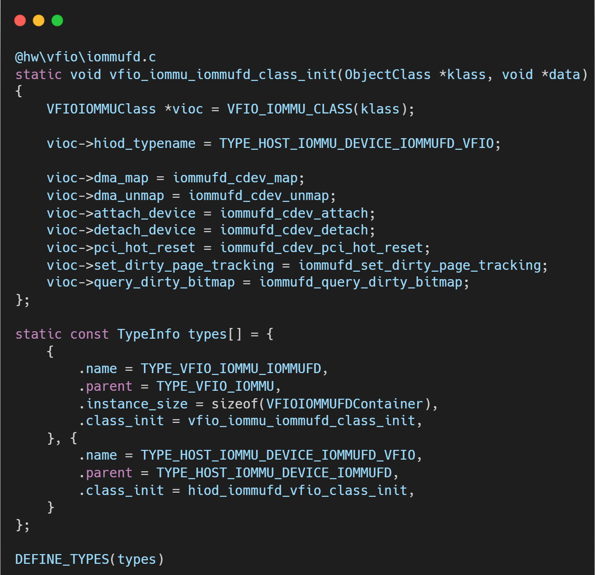
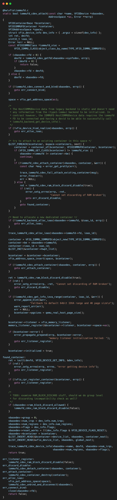
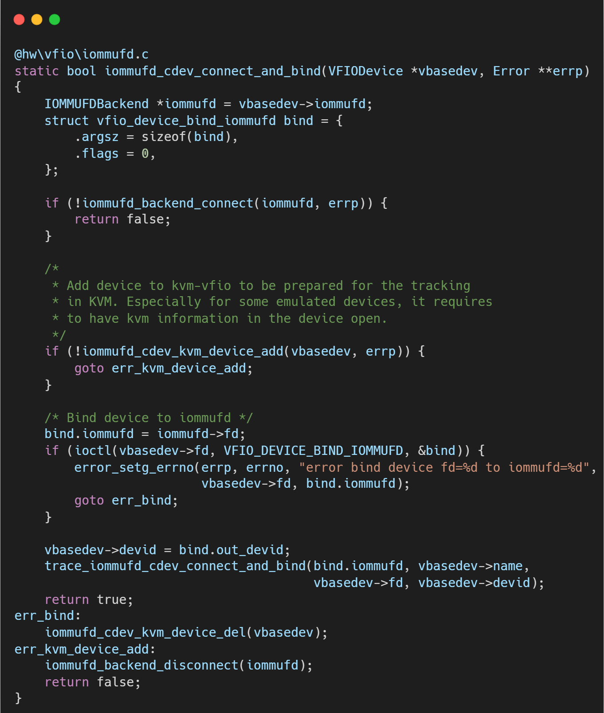
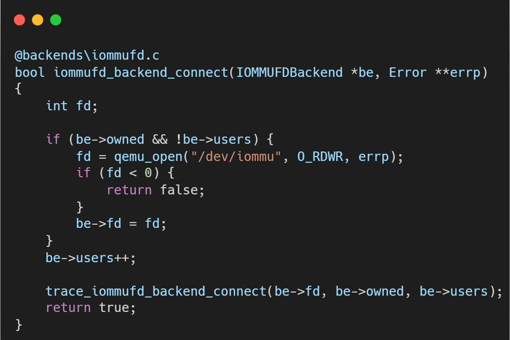
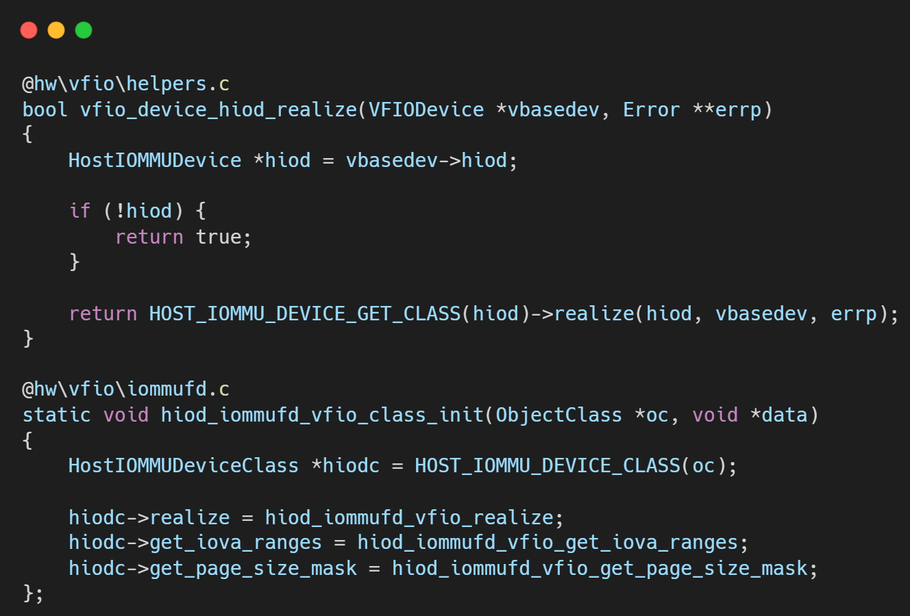
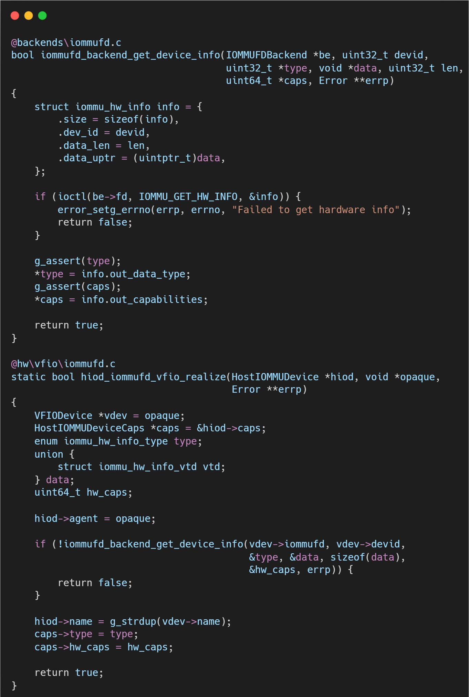

# VFIO框架源码分析（十八）- IOMMUFD 架构引入：对象模型重构与连接建立

## 简介与背景

回顾 Linux 内核 I/O 虚拟化的演进史，Linux 6.2内核引入的 **IOMMUFD** 子系统无疑是一个里程碑式的事件。

在此之前，VFIO 子系统一直肩负着双重重任：既要管理设备直通（PCI 配置空间、中断等），又要管理 IOMMU 映射（Type1 驱动）。这种耦合在早期简化了设计，但随着硬件复杂度的提升（如 PASID、嵌套翻译、异构计算），旧有的架构逐渐不堪重负。

IOMMUFD 的出现，旨在将 IOMMU 管理功能从 VFIO、vDPA 等子系统中剥离出来，形成一个通用的、统一的 IOMMU 管理框架。对于 QEMU 而言，这不仅仅是一个新的功能特性，而是意味着 `hw/vfio` 目录下需要引入一套全新的后端实现——`iommufd.c`，以取代使用了十余年的 Legacy（Container/Group）后端。

IOMMUFD 最核心的变革在于抛弃了模糊不清的 "Container/Group" 概念，转而引入了清晰的 **基于 ID 的对象模型 (ID-based API)**。在这种架构下，所有的 IOMMU 资源——无论是虚拟地址空间（IOAS）、物理设备（Device）还是硬件页表（HWPT）——都变成了内核管理的对象，用户态通过一个简单的 `u32` 类型 ID 来引用和操作它们。

本文将作为 IOMMUFD 系列的开篇，带大家深入 QEMU 源码，解析 IOMMUFD 的初始化流程以及它是如何建立起通往内核新世界的连接的。

## 核心入口：`vfio_attach_device` 的分叉路口

在 QEMU v10.0.3 中，VFIO 采用了 **Ops（操作接口）** 抽象层来隔离 Legacy（Type1）和 IOMMUFD 两种后端。QEMU 引入了 `IOMMUFDBackend` 对象来管理 `/dev/iommu` 的文件描述符，实现了真正的“资源池化”。

本文将基于深入代码层面，解析 QEMU 是如何在 `vfio_realize` 阶段切换到 IOMMUFD 路径，并建立设备与 IOMMUFD 上下文的连接。

在 Legacy 时代，`vfio_attach_device` 直接去打开 Container 和 Group。但在 v10.0.3 中，这里成为了一个关键的分叉点。代码会根据设备配置决定走哪条路。

### 动态选择后端 Class

在 `hw/vfio/common.c` 中，`vfio_attach_device` 不再硬编码逻辑，而是查找 `VFIO_IOMMU_CLASS`。

*   **`vbasedev->iommufd` 来源**：
    这是 QEMU 命令行解析的结果。用户通过 `-device vfio-pci,iommufd=iommufd0` 传入一个 `IOMMUFDBackend` 对象的引用。

*   **多态机制**：
    QEMU 定义了 `TYPE_VFIO_IOMMU_IOMMUFD` 类型，其 Class Init 函数 `vfio_iommu_iommufd_class_init` 注册了一组 IOMMUFD 专用的操作函数（attach, detach, dma_map 等）。
*   **设计意义**：
    这种设计将 IOMMU 后端的选择权交给了用户配置，同时在代码层面实现了完美解耦。VFIO 设备本身不需要关心底层是 `/dev/vfio` 还是 `/dev/iommu`，它只管调用 `ops->attach_device`。

## 逐层代码拆解：IOMMUFD 的连接与绑定

当 `ops` 被切换为 `TYPE_VFIO_IOMMU_IOMMUFD` 后，`ops->attach_device` 实际上调用的是 `hw/vfio/iommufd.c` 中的 `iommufd_cdev_attach`。

### 关键函数：`iommufd_cdev_connect_and_bind`

当用户启动 QEMU 时：`qemu-system-x86_64 -object iommufd,id=iommufd0 ...`;

QEMU 会创建一个 `IOMMUFDBackend` 实例，打开 `/dev/iommu`，并持有该 fd。

VFIO 设备通过属性引用这个后端：`-device vfio-pci,host=00:01.0,iommufd=iommufd0`;

`vbasedev->iommufd` 指针就指向这个共享的后端对象。

设备 fd（`vbasedev->fd`）必须被“绑定”到 IOMMUFD fd（`vbasedev->iommufd->fd`）上。

绑定成功后，内核返回一个 `devid`。以后对该设备的所有 IOMMU 操作（如 Attach 到 IOAS），都使用这个 `devid`，而不是 Group ID。

### Host IOMMU Device (HIOD) 初始化：`vfio_device_hiod_realize`

`TYPE_HOST_IOMMU_DEVICE_IOMMUFD_VFIO`。这是一个 QOM 对象，用于抽象宿主机侧的 IOMMU 设备能力。

`vfio_device_hiod_realize` 会调用 `hiod_iommufd_vfio_class_init` 中注册的方法`hiod_iommufd_vfio_realize`，通过 `IOMMU_GET_HW_INFO` ioctl 获取底层硬件（如 Intel VT-d 或 ARM SMMU）的具体信息。

## 总结

在 QEMU v10.0.3 中，VFIO 引入 IOMMUFD 的代码路径是非常清晰且模块化的：

1.  **解耦入口**：`vfio_attach_device` 通过判断 `vbasedev->iommufd` 是否存在，决定加载 `Legacy` 还是 `IOMMUFD` 的 Ops 类。

2.  **复用连接**：不再由每个设备单独打开 IOMMU 控制器，而是复用全局的 `IOMMUFDBackend` 对象。

3.  **标准化流程**：`iommufd_cdev_attach` -> `iommufd_cdev_connect_and_bind` -> `vfio_device_hiod_realize`。这套流程确保了设备在挂载到虚拟地址空间（IOAS）之前，已经正确完成了与 IOMMUFD 子系统的握手（Bind）和硬件能力探测（HIOD Realize）。

这种架构重构，彻底清理了 Legacy 模式下 Group 和 Container 纠缠不清的逻辑，为后续支持嵌套翻译（Nested Translation）和硬件脏页位图奠定了坚实的对象模型基础。

## 关于作者

大家好，我是宝爷，浙大本科、前华为工程师、现某芯片公司系统架构负责人，关注个人成长。

新的图解文章都在公众号「宝爷说」首发，别忘记关注了哦！

感谢你读到这里。

如果这篇文章对您有所帮助，欢迎点赞、分享或收藏！你的支持是我创作的动力！

如果您不想错过未来的更新，记得点个星标 ⭐，下次我更新你就能第一时间收到推送啦。