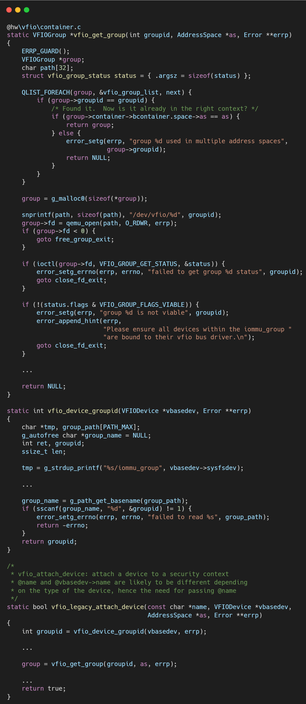
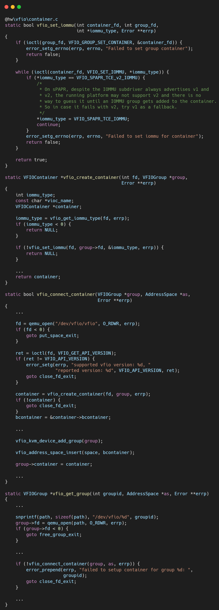
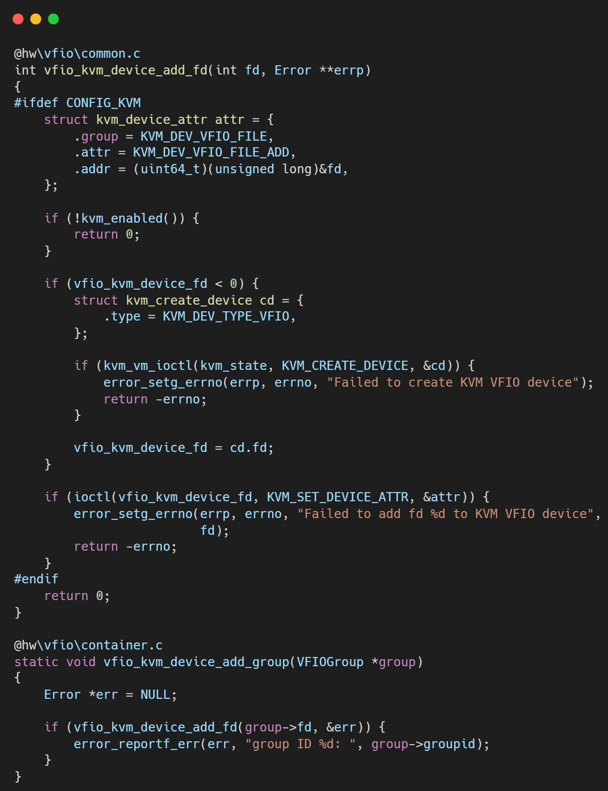

# VFIO框架源码分析（十三）- Legacy VFIO 的基石：Container 与 Group 模型详解

## 简介与背景

在 Linux 引入 IOMMUFD 之前，VFIO 子系统主要依赖 Type1 IOMMU 后端。

这一套设计诞生于 2012 年左右，其核心概念是 Container（容器）和 Group（组）。

Group: 是 IOMMU 硬件进行隔离的最小单元。

由于 PCIe 拓扑（如 ACS 支持情况）的限制，某些设备之间可能发生 P2P DMA，无法完全隔离，因此它们必须必须被归为一组，同生共死。

Container: 是一个软件概念，代表一个 IOMMU 上下文（页表空间）。

理解这两个概念的关系，是理解 Legacy VFIO 代码逻辑（hw/vfio/container.c）的前提。

## 逐层代码拆解

在 QEMU 代码中，VFIOContainer 维护了一个 group_list。这反映了它们的一对多关系：一个 Container 可以包含多个 Group，这些 Group 共享同一套页表映射。

### 寻找归宿：vfio_get_group

当 QEMU 初始化一个设备时，首先通过 sysfs (/sys/bus/pci/devices/.../iommu_group) 找到它所属的 groupid。

**打开 Group**: 调用 open("/dev/vfio/<groupid>")。这只是获得了操作该组的句柄，此时设备尚不可用。

**状态检查**: 必须确保 Group 内所有设备都已绑定到 vfio-pci 驱动，否则 Group 不可视作“Viable”。

### 创建空间：vfio_connect_container

如果没有现成的 Container 可用，QEMU 需要新建一个。

**打开 Container**: fd = open("/dev/vfio/vfio")。

**版本检查**: ioctl(VFIO_GET_API_VERSION)，确保内核 ABI 兼容。

**关联Container 和 Group fd**: ioctl(group_fd, VFIO_GROUP_SET_CONTAINER, &container_fd)。

此时，内核会将该 Group 下的所有设备 attach 到 Container 对应的 IOMMU Domain 上。如果 Container 已经有了内存映射，这些设备会立即继承这些映射，获得 DMA 访问内存的能力。

**模式设置**: 关键一步——ioctl(container_fd, VFIO_SET_IOMMU, *iommu_type)。这告诉内核：“这个 Container 将使用 x86/ARM 通用的 Type1 IOMMU 驱动来管理页表”。如果失败，说明内核不支持或配置错误。

### 组队入列：vfio_kvm_device_add_group

将设备绑定到group上。

## 总结

Legacy 模型的建立过程是一个自下而上（从 Device 到 Group）再结合（Group 到 Container）的过程。

它的核心设计哲学是隐式关联：

用户操作 Container 进行 MAP/UNMAP，而所有加入该 Container 的 Group 自动同步。

这种设计在早期简化了 API，但在如今复杂的异构计算场景下（如需要细粒度的 PASID 支持），其局限性逐渐暴露，这也是 IOMMUFD 诞生的原因。

## 关于作者

大家好，我是宝爷，浙大本科、前华为工程师、现某芯片公司系统架构负责人，关注个人成长。

新的图解文章都在公众号「宝爷说」首发，别忘记关注了哦！

感谢你读到这里。

如果这篇文章对您有所帮助，欢迎点赞、分享或收藏！你的支持是我创作的动力！

如果您不想错过未来的更新，记得点个星标 ⭐，下次我更新你就能第一时间收到推送啦。