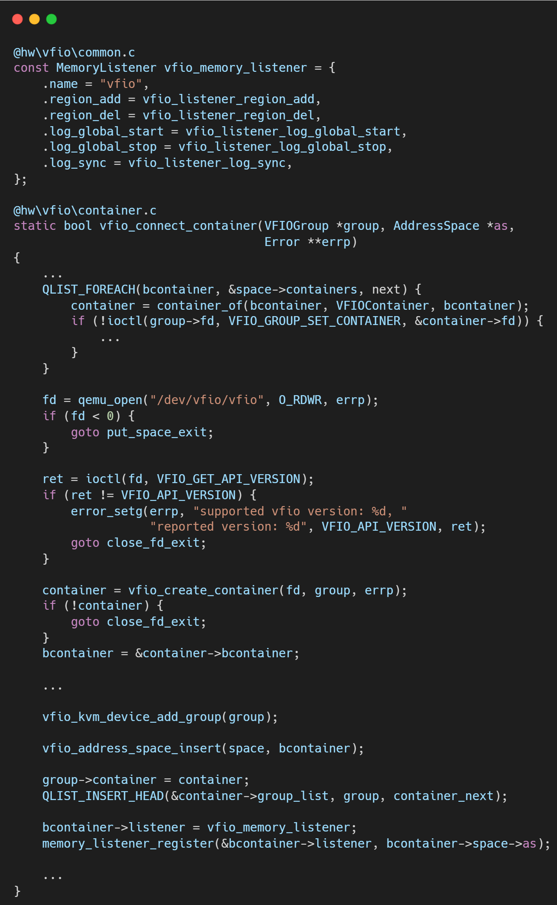
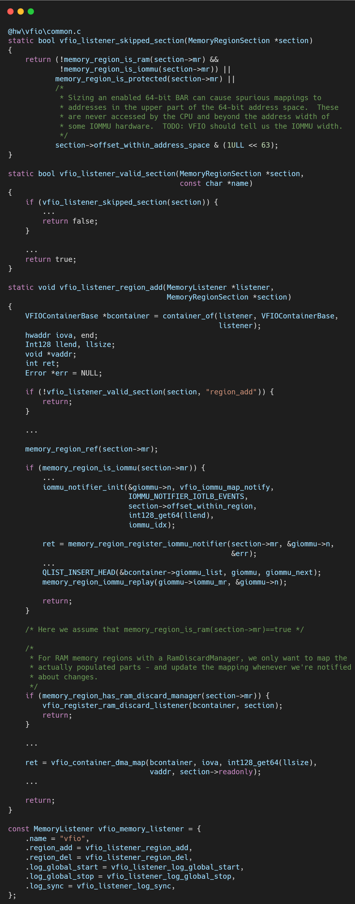
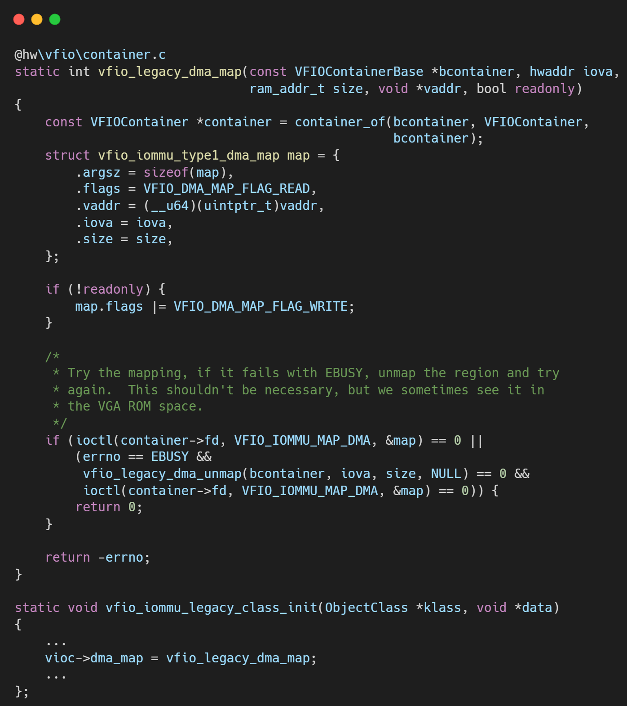

# VFIO框架源码分析（十四）- Legacy 模式下的内存监听器 (Memory Listener)

## 简介与背景

虚拟机看到的“物理内存”（Guest Physical Address, GPA）实际上是 QEMU 进程的虚拟内存（Host Virtual Address, HVA）。

当 Guest 驱动配置网卡 DMA 到地址 0x10000 时，真实的物理网卡必须知道 0x10000 对应的真实物理地址（Host Physical Address, HPA）是多少。

IOMMU 的作用就是负责这个翻译。

而 QEMU 的 Memory Listener 机制，就是负责实时监控 Guest 内存布局的变化，并同步更新 Host IOMMU 的页表，确保翻译始终正确。

## 逐层代码拆解

vfio_memory_listener这是一个定义在 hw/vfio/common.c 中的静态结构体，包含了一组回调函数指针：region_add, region_del, log_sync 等。它被注册到 QEMU 全局的 system_memory 地址空间上。

### 监听注册：memory_listener_register

在 Container 初始化成功后，QEMU 调用此函数。

QEMU 的内存子系统会立即遍历当前所有已存在的 MemoryRegion，并对每一个 Region 调用 region_add 回调。这被称为“重放（Replay）”。

之后如果 Guest 热插拔了内存条（DIMM Hotplug），region_add 会再次被触发。

### 区域过滤：vfio_listener_region_add

并非所有内存区域都需要 IOMMU 映射。检查内存是否可写、是否是 RAM。

设备的寄存器空间（如显存 BAR）通常不需要映射回 IOMMU（除非支持 P2P DMA）。

自身的 vIOMMU 区域不能再映射到物理 IOMMU（避免死循环）。

### 建立映射：vfio_legacy_dma_map

这是同步的核心。

**参数准备**: 获取 Region 的 vaddr（HVA）、iova（GPA）和 size。

**内核调用**: 构造 struct vfio_iommu_type1_dma_map，执行 ioctl(container->fd, VFIO_IOMMU_MAP_DMA, &map)。

**内核行为**:

**Pin Pages**: 内核调用 get_user_pages 锁定对应的物理页，防止被 swap 出去。

**IOMMU Map**: 调用 iommu_map，在硬件页表中填入 GPA -> HPA 的条目。

**Huge Page**: 如果 QEMU 使用了大页（HugeTLB/Transparent Huge Page），内核会自动识别并建立大页 IOMMU 映射，显著减少 TLB Miss。

## 总结

vfio_memory_listener 是 QEMU 保持内存视图一致性的守护者。

在 Legacy 模式下，它的每一次操作都作用于 Container FD。

这意味着，如果一个 Container 绑定了 10 个 Group，一次 MAP_DMA 调用，内核底层可能需要更新 10 个 IOMMU Domain 的页表。

这种“一呼百应”的机制虽然方便，但也潜藏着性能扩展性的问题。

## 关于作者

大家好，我是宝爷，浙大本科、前华为工程师、现某芯片公司系统架构负责人，关注个人成长。

新的图解文章都在公众号「宝爷说」首发，别忘记关注了哦！

感谢你读到这里。

如果这篇文章对您有所帮助，欢迎点赞、分享或收藏！你的支持是我创作的动力！

如果您不想错过未来的更新，记得点个星标 ⭐，下次我更新你就能第一时间收到推送啦。