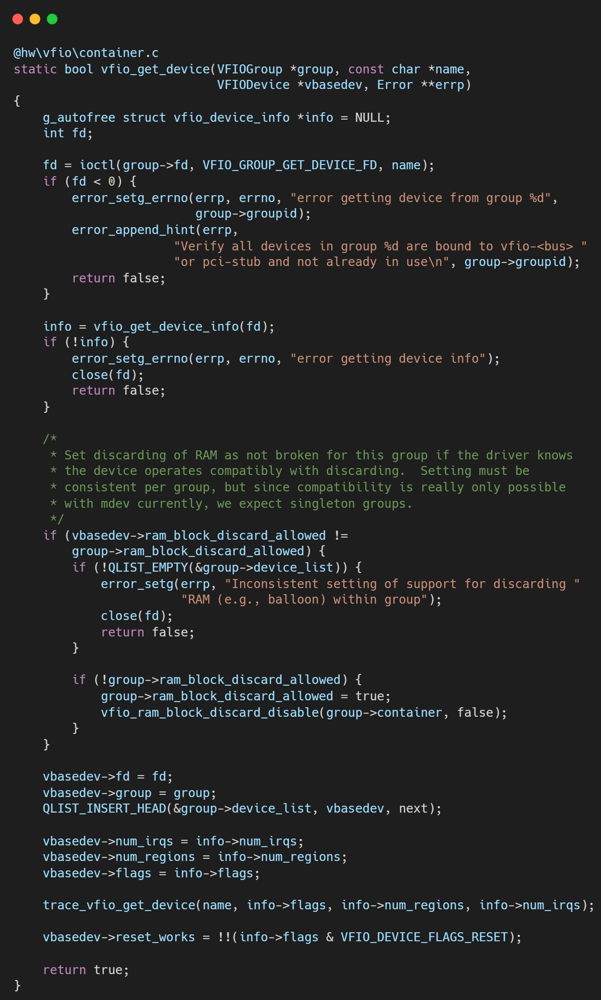
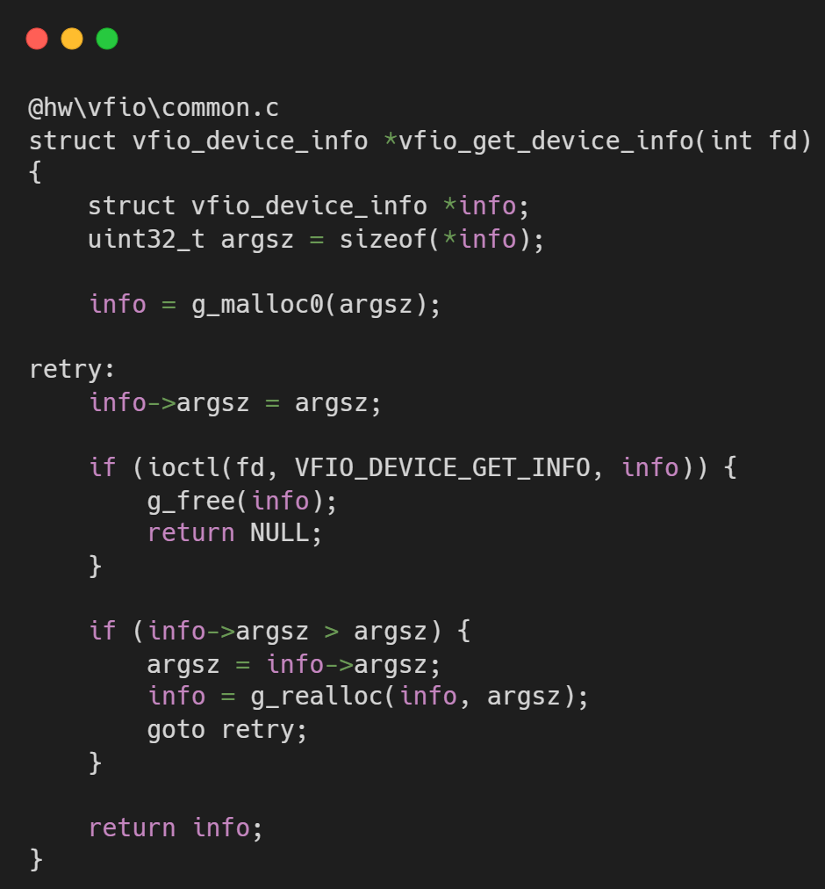

# VFIO框架源码分析（十五）- Legacy VFIO 的设备获取与描述符管理机制

## 简介与背景

在理解了 Container 和 Group 的宏观结构后，我们需要回到微观视角：QEMU 如何获得具体某个设备的操作句柄？

在 Linux 文件系统中，一切皆文件。

VFIO 设备也不例外，它通过一个特定的文件描述符（Device FD）向用户态暴露其配置空间、BAR 空间和中断控制接口。

在 Legacy 模型中，Device FD 的获取路径非常独特，它不是直接 open 某个路径，而是通过 Group FD 衍生出来的。

## 逐层代码拆解

### 标识设备：Name String

调用该函数时，传入了一个 name 字符串。对于 PCI 设备，这通常是它的 BDF（Bus:Device.Function），例如 "0000:02:00.0"。

这个字符串必须与 sysfs 中该设备的名称完全一致，因为内核 VFIO 驱动会用它来在 Group 的设备链表中查找目标。

### 衍生 FD：VFIO_GROUP_GET_DEVICE_FD

这是关键的 ioctl 调用。

**Caller**: 操作对象是 group->fd。

**Kernel**: 详见**VFIO框架源码分析（二）- PCI设备的生命周期管理**分析

这种设计强制了层级依赖。你必须先搞定 Group 和 Container（解决了 IOMMU 隔离问题），才能拿到 Device FD（解决设备访问问题）。

### 信息缓存：VFIODevice 结构体

拿到 FD 后，QEMU 会初始化 VFIODevice 结构。

Region 计数: ioctl(VFIO_DEVICE_GET_INFO) 获取设备有多少个 Region（BAR、Config、VGA 等）。

Irq 计数: 获取设备支持多少种中断。

这些基本信息会被缓存起来，避免后续频繁调用 ioctl。

### 奇怪的“错位”

在 Legacy 代码中，你会发现一个有趣的现象：

DMA 操作（Map/Unmap）是用 container->fd 做的。

设备复位/中断/读写 BAR 是用 vbasedev->fd 做的。

这种分离是 Type1 后端的特征。设备 FD 并不包含 IOMMU 映射能力，它只负责设备本身的控制。

## 总结

vfio_get_device 揭示了 Legacy VFIO 严格的层级控制。

Device 寄生于 Group，Group 寄生于 Container。

虽然这种设计确保了安全性（不会有人绕过 IOMMU 直接操作设备），但也使得代码结构变得僵化。

例如，想在一个 Group 内把不同设备分配给不同虚拟机？

Legacy 说：这在物理上是不安全的，所以我从 API 层面就禁止你这样做。

## 关于作者

大家好，我是宝爷，浙大本科、前华为工程师、现某芯片公司系统架构负责人，关注个人成长。

新的图解文章都在公众号「宝爷说」首发，别忘记关注了哦！

感谢你读到这里。

如果这篇文章对您有所帮助，欢迎点赞、分享或收藏！你的支持是我创作的动力！

如果您不想错过未来的更新，记得点个星标 ⭐，下次我更新你就能第一时间收到推送啦。
