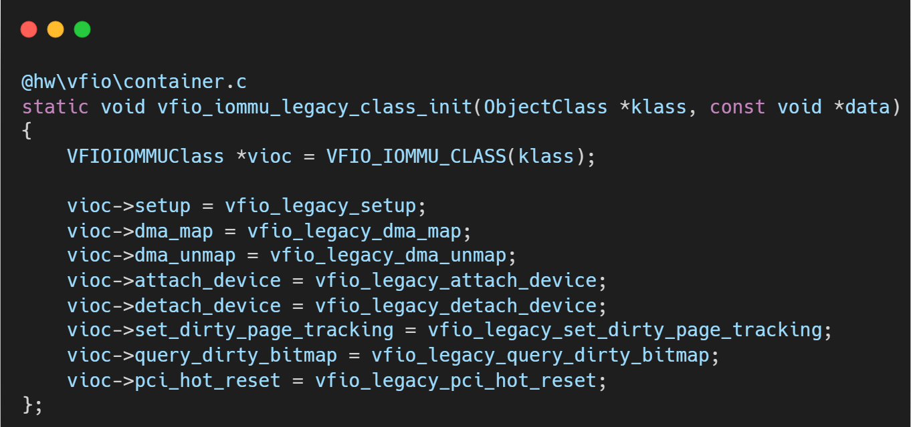
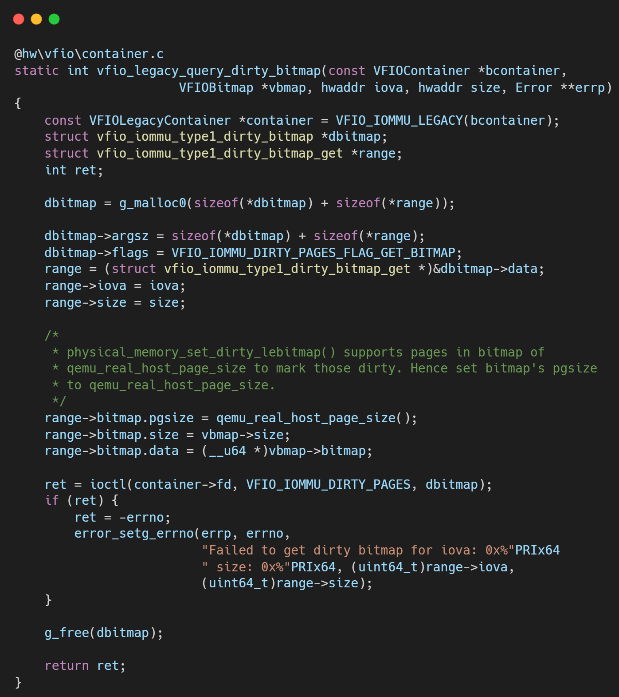
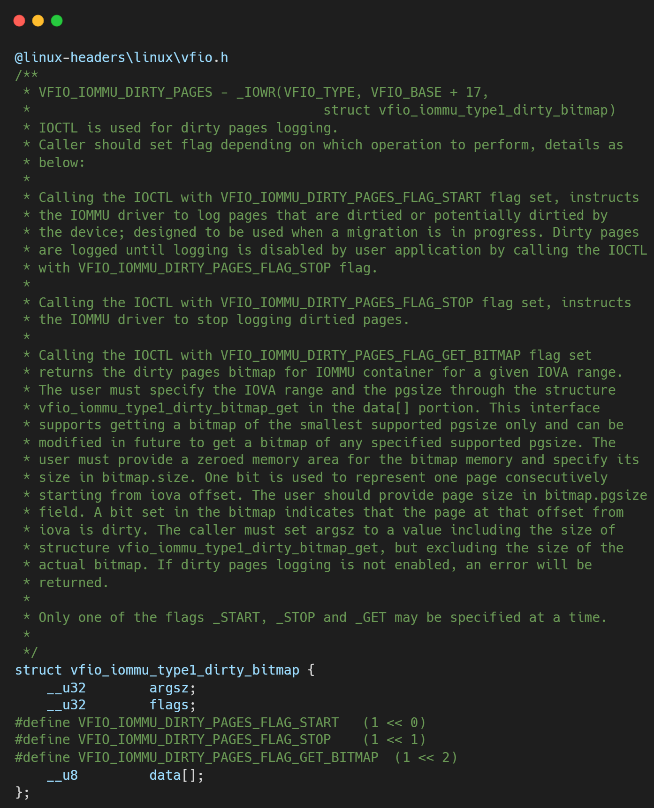

# VFIO框架源码分析（十六）- Legacy 模式下的脏页位图查询实现细节

## 简介与背景

在**QEMU VFIO 实时迁移 (Live Migration) 架构深度解析**中，脏页追踪（Dirty Page Tracking）是确保数据一致性的核心环节。

对于纯软件模拟的设备（如 Virtio），QEMU 能够完全感知每一次内存写操作，因此维护脏页位图轻而易举。然而，当引入 VFIO 直通设备时，情况变得复杂起来。

在直通模式下，设备通过 DMA（Direct Memory Access）直接访问 Guest 的物理内存，完全绕过了 QEMU 的软件模拟层。这意味着 QEMU 根本不知道设备何时、何地写入了数据。

如果迁移过程中无法准确捕获这些被设备修改过的内存页，并在最后一轮停机拷贝前将其同步到目标主机，那么迁移后的虚拟机将面临文件系统损坏或内存数据不一致的灾难性后果。

为了解决这个问题，Legacy VFIO 后端（Type1 IOMMU）引入了一套脏页查询机制。其核心逻辑建立在VFIOContainer之上。Container 代表了 IOMMU 的一个隔离地址空间（Domain），所有挂载到该 Container 下的设备共享同一套页表。因此，内核中的 IOMMU 子系统是唯一能够“感知”或“推断”DMA 写操作的地方。

本文将深入 QEMU 的源码深处，剖析在 Legacy 模式下，QEMU 是如何通过 `ioctl` 向内核“索取”这份至关重要的脏页清单的。

## 逐层代码拆解

### 核心接口：`vfio_legacy_query_dirty_bitmap`



`VFIOIOMMUClass` 定义了标准的 `query_dirty_bitmap` 接口。在 Legacy 后端中，该接口指向 `vfio_legacy_query_dirty_bitmap`。这个函数的主要职责是将 QEMU 的内存查询请求转换为内核 VFIO 子系统能够理解的格式。



### 1. 复合结构体的内存布局

QEMU 并没有直接使用栈上的变量，而是通过 `g_malloc0` 分配了一块动态内存。这里揭示了 VFIO ioctl 的设计模式——**变长结构体**。

**深度解析：**
内核定义的 `struct vfio_iommu_type1_dirty_bitmap` 实际上只是一个“命令头”：
*   `argsz`: 整个参数块的大小。
*   `flags`: 操作标志位。
*   `data[]`: 柔性数组（Flexible Array Member），这是存放具体操作参数的地方。



QEMU 在这里巧妙地将 `dbitmap->data` 视为存放 `struct vfio_iommu_type1_dirty_bitmap_get` 结构的起点。

```c
range = (struct vfio_iommu_type1_dirty_bitmap_get *)&dbitmap->data;
```

通过这种强制类型转换，QEMU 构建了一个紧凑的内存块：`[ Header ][ Range Specifier ]`。这种设计允许未来内核扩展支持一次性查询多个不连续的 Range，但在 QEMU 的当前实现中，每次调用只查询一个 Range。

### 2. 构造请求头与范围描述符

接下来，代码填充这个复合结构体。

*   **`argsz`**: 必须精确等于申请的内存总大小，内核会校验此值以确保 ABI 兼容性。
*   **`flags`**: 设置 `VFIO_IOMMU_DIRTY_PAGES_FLAG_GET_BITMAP`，明确告知内核“我不是来开启追踪的，我是来取回脏页数据的”。

### 3. 关键细节：Bitmap 缓冲区的传递

`range` 结构体内部包含了一个 `struct vfio_bitmap` 子结构。这里有三个至关重要的字段：

1.  **`pgsize`**: **页大小协商**。QEMU 显式告诉内核：“请按照 `qemu_real_host_page_size()`（通常是 4KB 或 64KB，取决于 Host 架构）的粒度来标记脏页”。如果内核记录的粒度与此不符（例如内核用 2MB 大页记录），内核驱动必须负责进行转换或位图展开。

2.  **`size`**: 用户态分配的位图缓冲区的大小（字节数）。内核会检查这个大小是否足以容纳 `range->size / range->bitmap.pgsize` 个比特。

3.  **`data`**: **这是指针的指针**。
    *   `vbmap->bitmap` 是 QEMU 在用户态堆上分配的实际存放位图数据的内存区域。
    *   `range->bitmap.data` 被赋值为这个用户态缓冲区的地址。
    *   **注意**：这里并不是把位图数据拷贝进结构体，而是把**存放数据的地址**传给内核。内核在 ioctl 处理过程中，会使用 `copy_to_user` 将脏页状态直接写入 `vbmap->bitmap` 指向的内存。

### 4. 内核交互与错误处理

*   **调用对象**：`container->fd`。Legacy 模式下，脏页查询是针对整个 Container 的。

*   **原子性**：虽然这是一个“查询”操作，但对于某些硬件实现，读取脏页位图可能会有“清零（Clear-on-Read）”的副作用（尽管 VFIO 协议通常要求原子读取，或者由用户态显式清除）。

*   **错误处理**：如果返回值非零，QEMU 会将 `errno` 封装进 `Error **errp` 对象，向上层调用者（迁移线程）报告失败。常见的错误包括缓冲区太小（`EINVAL`）或未开启脏页追踪（`ENOENT`）。

### 5. 局限性与设计反思

通过代码可以看出，Legacy 接口的设计深受 Container 模型的影响：

1.  **粒度粗糙**：请求是发给 Container 的。如果 Container 内有多个 Group，内核会扫描该 Container 下所有 IOMMU Domain 的脏页记录并取并集。无法区分具体是哪个设备产生的脏页。

2.  **内存开销**：虽然使用了指针传递，但用户态必须预先分配足量的连续内存来接收位图。对于超大内存虚拟机，这依然是一笔不小的开销。

3.  **协议开销**：每次 ioctl 只能处理一个 IOVA Range（虽然结构体支持扩展，但 QEMU 目前是循环调用）。对于内存高度碎片化的场景，系统调用次数可能较多。

### 总结

`vfio_legacy_query_dirty_bitmap` 是 QEMU 与 Linux 内核在脏页数据交换上的“协议层”。它通过精心构造的 `vfio_iommu_type1_dirty_bitmap` 结构，完成了以下任务：

1.  **定义范围**：告诉内核查询哪段 IOVA。

2.  **协商格式**：指定页大小 (`pgsize`)。

3.  **提供容器**：传入用户态缓冲区的地址 (`data`)。

理解这一函数，就理解了 Legacy VFIO 迁移的数据同步基石。正是这些看似枯燥的结构体填充和 ioctl 调用，保证了虚拟机在跨主机迁移时，直通设备的数据修改不会悄无声息地丢失。

## 关于作者

大家好，我是宝爷，浙大本科、前华为工程师、现某芯片公司系统架构负责人，关注个人成长。

新的图解文章都在公众号「宝爷说」首发，别忘记关注了哦！

感谢你读到这里。

如果这篇文章对您有所帮助，欢迎点赞、分享或收藏！你的支持是我创作的动力！

如果您不想错过未来的更新，记得点个星标 ⭐，下次我更新你就能第一时间收到推送啦。