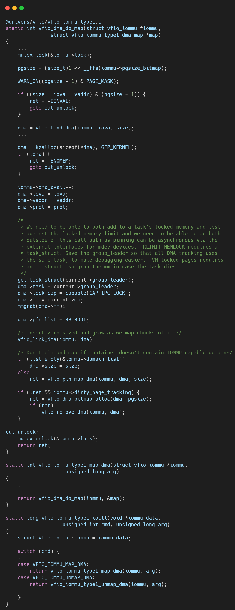
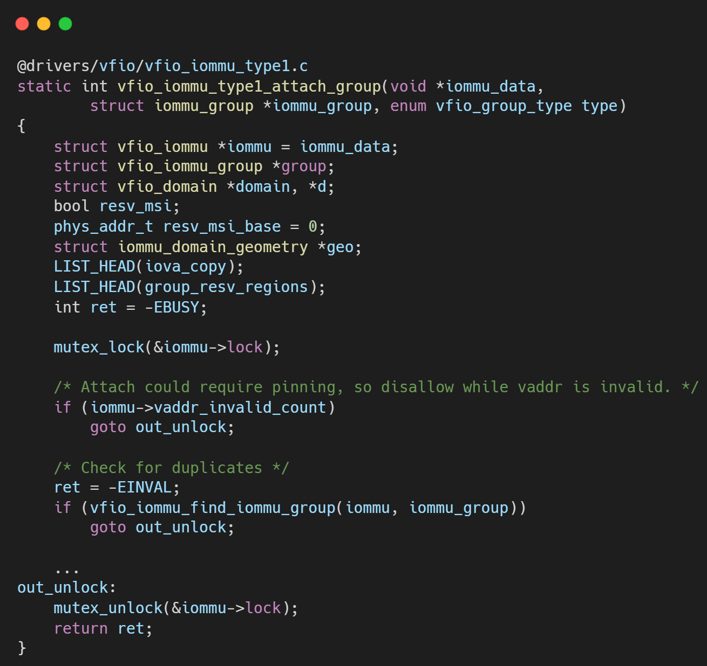
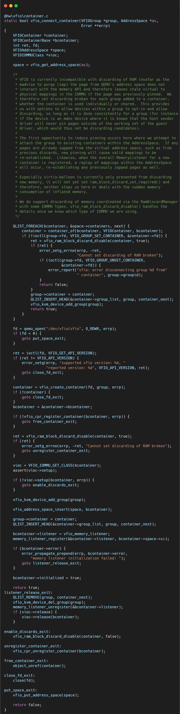
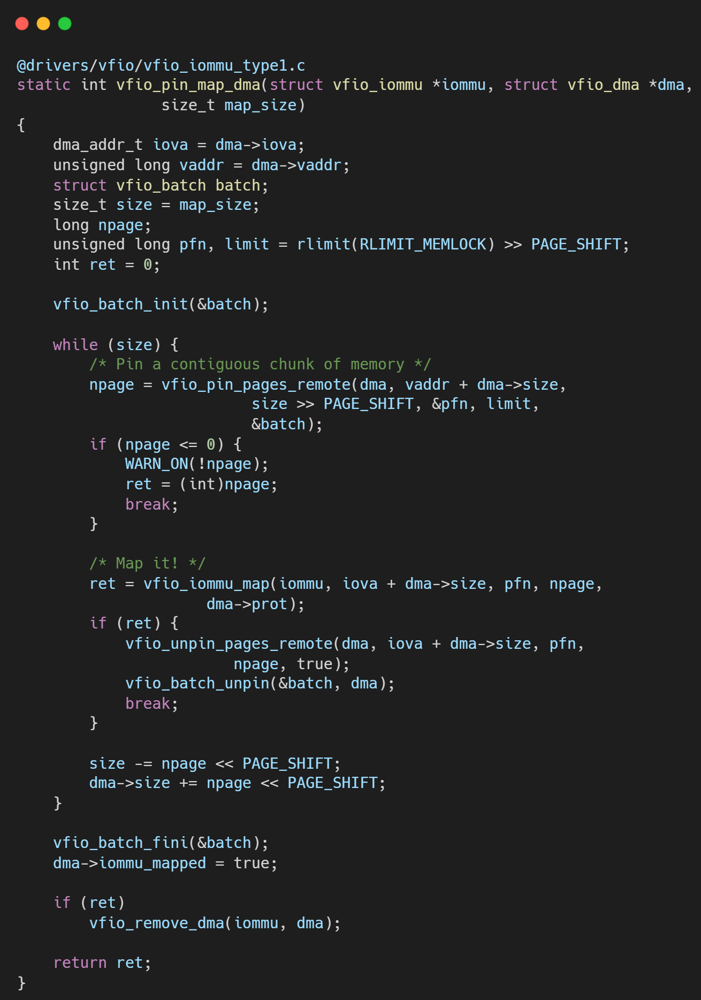

# VFIO框架源码分析（十七）- Legacy VFIO 的局限性与设计反思

## 简介与背景

回顾 Linux 虚拟化技术的发展史，Legacy VFIO (Type1 IOMMU) 无疑是一座丰碑。自 2012 年并入内核主线以来，它以稳健的姿态支撑了云计算十余年的蓬勃发展，使得网卡、GPU 等 PCI 设备直通成为云主机的标配。

然而，软件架构的生命力往往取决于它对硬件演进的适应能力。随着 AI 大模型训练、异构计算（CXL）、复杂高性能网络（RDMA/DPU）以及 SVA（Shared Virtual Addressing）等新技术的兴起，Legacy VFIO 开始显露疲态。它那诞生于 "静态设备直通" 时代的设计哲学，在面对如今 "动态、细粒度、硬件协同" 的需求时，显得左支右绌。

QEMU 社区与内核社区联手引入 IOMMUFD，并非仅仅为了重构代码，而是为了解决 Legacy 模型中那些深埋在根基里、难以通过“打补丁”来修复的结构性缺陷。本文将深入 QEMU 源码的实现细节，剖析 Legacy 模型到底“错”在哪里，为何我们必须通过 IOMMUFD 开启新的篇章。

## 2. 核心痛点分析

### 2.1 锁的诅咒：Big Lock 导致的并发瓶颈

在 Legacy VFIO 的设计中，`VFIOContainer` 是核心的管理单元。在 QEMU 代码层面，你或许看不到一把显式的“全局大锁”，但性能瓶颈往往隐藏在系统调用（syscall）的另一端——Linux 内核。

*   **内核机制**：Linux 内核中的 `vfio_iommu_type1` 驱动在处理 DMA 映射（`VFIO_IOMMU_MAP_DMA`）和解映射（`VFIO_IOMMU_UNMAP_DMA`）时，严重依赖于一把粗粒度的互斥锁（Mutex）。这把锁保护着整个 Container 的 IOMMU页表域（Domain）。
*   **现象与后果**：
    *   **虚拟机启动慢**：对于动辄数 TB 内存的大规格 AI 虚拟机，QEMU 需要在启动阶段并发建立大量的内存映射。然而，由于 Container 级锁的存在，即便是多线程调用 `ioctl`，在内核层也会被迫串行化，导致大内存虚拟机的启动时间随内存大小线性甚至指数级增长。
    *   **实时性抖动**：在设备热插拔或动态内存调整（Memory Ballooning）场景下，Map/Unmap 操作会长时间持有锁。此时，如果 vCPU 线程或其他设备试图访问或修改映射，可能会遭到阻塞，从而在实时敏感业务中引发不可接受的延迟抖动（Jitter）。
    *   **迁移效率低**：在热迁移过程中，脏页位图的查询和内存追踪也受制于这把锁，限制了迁移带宽的上限。

相比之下，IOMMUFD 引入了细粒度的对象锁，甚至支持无锁的并发 Map 操作，彻底解开了这道束缚。

### 2.2 隐式绑定的噩梦：失控的拓扑管理

在**VFIO框架源码分析（十三）- Legacy VFIO 的基石：Container 与 Group 模型详解**和**VFIO框架源码分析（三）- IOMMU后端Type1驱动与DMA隔离**中，我们经常能看到复杂的逻辑试图判断一个 Group 是否能 Attach 到现有的 Container。这源于 Legacy 接口的一个核心设计缺陷——**隐式绑定**。

*   **黑盒接口**：`VFIO_SET_IOMMU` 和 `VFIO_GROUP_SET_CONTAINER` 是 Legacy 模式下的两个关键操作。
    *   用户态（QEMU）只能做一件事：把 Group 扔进 Container。
    *   至于内核是为这个 Group 分配一个新的 IOMMU Domain，还是让它与现有的 Group 共享同一个 Domain，完全由内核驱动内部的策略决定，用户态对此几乎**零控制权**。

*   **逻辑纠缠**：
    *   为了适配这种“听天由命”的逻辑，QEMU 必须维护一个复杂的 `space->containers` 链表。
    *   当插入新设备时，QEMU 需要遍历链表，尝试将新 Group Attach 到每一个已有的 Container，通过 `ioctl` 的返回值来“猜测”内核是否允许它们共享页表。
    *   这导致了 `vfio_connect_container` 函数中充满了各种 `try_attach`、回退（Fallback）、错误处理和重试逻辑。代码晦涩难懂，且极其脆弱，稍有不慎就会破坏 IOMMU 的隔离性或导致资源泄露。
*   **无法表达的意图**：如果用户希望明确地让设备 A 和设备 B 隔离（使用不同的页表），或者强制它们共享（使用相同的页表以支持 P2P DMA），Legacy 接口很难直接、清晰地表达这种意图。

### 2.3 缺乏 PASID 支持：现代特性的拦路虎

随着 PCIe 规范的演进，PASID（Process Address Space ID）成为了现代高性能设备的关键特性。它允许设备通过 SVA（Shared Virtual Memory）技术，直接访问宿主机进程的虚拟地址空间，实现 CPU 与 GPU/网卡的零拷贝数据共享。

*   **Legacy 的困境**：
    *   Legacy Type1 接口的设计前提是：**一个设备对应一个 IOVA 空间**。在这个模型里，DMA 地址就是单纯的 64 位 IOVA。
    *   要支持 SVA，DMA 请求必须携带 `(PASID, IOVA)` 二元组。
*   **API 的僵化**：
    *   `VFIO_IOMMU_MAP_DMA` 的数据结构中根本没有预留 PASID 字段。
    *   如果在 Legacy 接口上强行支持 PASID，需要对现有的 ioctl 进行大规模的侵入式修改，甚至创造出一套“弗兰肯斯坦”式的 API。这不仅破坏了 ABI 兼容性，也违背了软件设计的开闭原则。
    *   因此，内核社区明确拒绝了在 Type1 中通过“打补丁”方式支持 PASID。这也意味着，只要使用 Legacy 后端，QEMU 就无法利用现代硬件的 Nested Translation（嵌套翻译）和 SVA 能力，这对于虚拟化场景下的 AI 加速是致命的缺失。

### 2.4 资源重复计费：低效的内存管理

在虚拟化环境中，物理内存页（Page）需要被 Pin（锁定）在内存中，防止被操作系统 Swap 出去，以保证 DMA 的安全性。

*   **隔离的代价**：
    *   Legacy VFIO 以 Container 为单位管理内存 Pinning。
    *   每个 Container 维护自己的 `pinned_page_list` 和计数器。
*   **重复计费（Double Counting）**：
    *   假设有两个虚拟机（或者一个虚拟机的两个不同设备挂在不同的 Container 下）映射了宿主机的同一块共享内存（Shared Memory）。
    *   Container A 会 Pin 一次这些页面，Container B 会再次 Pin 一次。
    *   **后果**：
        1.  **资源浪费**：内核中的 `page_ref_count` 被冗余增加，管理开销增大。
        2.  **额度超标**：用户的 `RLIMIT_MEMLOCK` 额度（允许锁定的最大内存）会被双倍消耗。这可能导致用户明明内存充足，却因为额度耗尽而无法启动虚拟机。
    *   相比之下，IOMMUFD 采用了统一的计费机制，无论多少个设备或 IOAS 映射同一页，在底层只进行一次有效的 Accounting，高效且精准。

## 3. 总结

Legacy VFIO 就像一辆经过无数次改装的老爷车。它曾经性能卓越，风光无限。但在面对今天的路况——AI 带来的超大带宽需求、异构计算带来的复杂拓扑、以及 SVA 带来的精细化控制——这辆老爷车的引擎架构（Type1）限制了它无法安装最新的涡轮增压器（PASID、硬件脏页、嵌套翻译）。

我们深入分析 Legacy 的局限性，并非为了否定它的历史贡献，而是为了理清技术演进的脉络。IOMMUFD 的出现，并不是为了修复 Legacy 的 Bug，而是为了推翻其“Container-Group”的陈旧地基，重建一座符合现代硬件特性、对象化、细粒度的摩天大楼。

理解了 Legacy 的痛，你才能真正看懂 IOMMUFD 设计中那些“多对象、ID索引、显式Bind”的精妙之处。

## 关于作者

大家好，我是宝爷，浙大本科、前华为工程师、现某芯片公司系统架构负责人，关注个人成长。

新的图解文章都在公众号「宝爷说」首发，别忘记关注了哦！

感谢你读到这里。

如果这篇文章对您有所帮助，欢迎点赞、分享或收藏！你的支持是我创作的动力！

如果您不想错过未来的更新，记得点个星标 ⭐，下次我更新你就能第一时间收到推送啦。