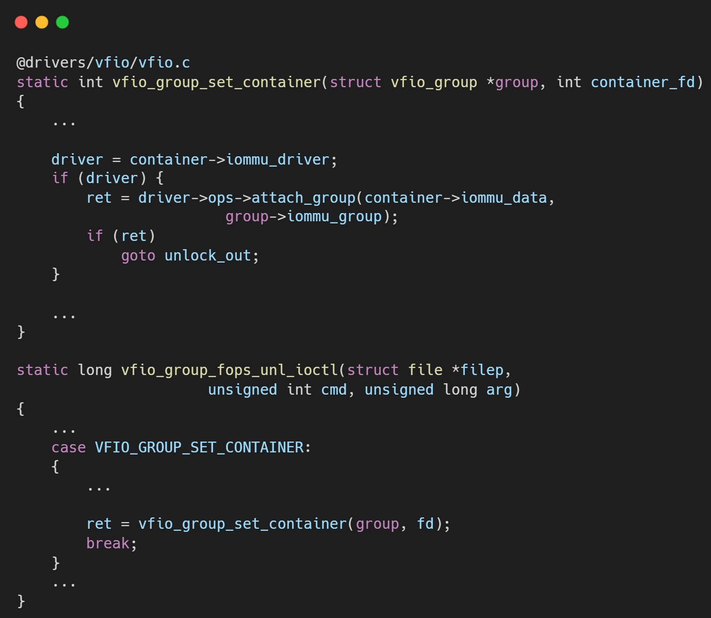

# VFIO框架源码分析（三）- IOMMU后端Type1驱动与DMA隔离

## 引言与整体框架

前面的文章我们已经剖析了VFIO的核心框架和面向PCI总线的`vfio-pci`驱动。然而，VFIO实现安全设备直通的基石——IOMMU（Input-Output Memory Management Unit）——是由一个独立的后端模块来管理的。`vfio-iommu-type1` 就是其IOMMU后端驱动。它利用内核原生的IOMMU API，为VFIO Container提供DMA地址翻译和内存保护服务。

当用户空间通过 `VFIO_SET_IOMMU` ioctl 为一个Container选择 `VFIO_TYPE1_IOMMU` 后端时，`vfio-iommu-type1` 驱动便正式接管了这个Container的内存管理。本文将详细解读该驱动的内部机制，重点分析它是如何为用户空间内存建立安全的IOMMU映射，从而允许直通设备进行DMA操作的。

**核心分析：驱动加载与接口注册**

`vfio-iommu-type1` 作为一个内核模块，其入口函数 `vfio_iommu_type1_init` 的核心任务就是注册一个 `vfio_iommu_driver_ops` 结构体——`vfio_iommu_driver_ops_type1`。这个结构体包含了VFIO核心层调用IOMMU后端所需的所有操作函数。一旦注册成功，VFIO核心便知道了"Type1"这种IOMMU后端的存在，并可以在 `VFIO_SET_IOMMU` 时找到并绑定它。

## 分步详解：核心功能实现

### **Group的附加 (`attach_group`)**

当一个 `vfio_group` 通过 `VFIO_GROUP_SET_CONTAINER` ioctl被设置到一个已经启用Type1后端的Container中时，`vfio_iommu_type1_attach_group` 函数会被调用（可以看《VFIO框架源码分析（一）- 从初始化到设备访问》了解group和container是如何关联的）。此函数负责将物理IOMMU Group的隔离能力赋予VFIO Container。

*   **同步DMA映射**: 一个关键的操作是 `vfio_iommu_replay`。这一机制确保了“当一个新的IOMMU域被加入到VFIO容器时，该容器中已有的DMA映射关系能够同步到这个新域上”。这意味着，如果用户先映射了一块内存，然后再加入一个新的设备组，这块已映射的内存对于新加入的设备也是可见的。这是通过遍历Container中已有的 `iova_list`（IO Virtual Address列表），并在新的IOMMU Domain中重建这些映射来实现的。

### **核心控制接口 (`ioctl`)**

`ioctl` 是用户空间与IOMMU后端交互的主要通道，由 `vfio_iommu_type1_ioctl` 函数处理。

*   **信息查询 (`VFIO_IOMMU_GET_INFO`)**: 允许用户空间查询IOMMU的能力，例如支持的页大小、IOVA（IO Virtual Address）地址空间范围等。

*   **DMA内存映射 (`VFIO_IOMMU_MAP_DMA`)**: 这是整个IOMMU后端最核心、最关键的功能。当用户空间（如QEMU）需要为Guest VM的一段物理内存（GPA）创建DMA映射时，它会调用此ioctl。
    1.  **参数**: 用户空间提供需要映射的物理内存地址（`vaddr`，即用户空间的虚拟地址）、大小（`size`）以及希望映射到的IOVA。
    2.  **内核处理 (`vfio_dma_do_map`)**:
        *   **查找与验证 (`vfio_find_dma`, `vfio_iommu_iova_dma_valid`)**: 首先，内核会检查用户指定的IOVA范围是否已经被占用，并验证其合法性。
        *   **锁定物理页面 (`vfio_pin_pages_remote`)**: 这是至关重要的一步安全措施。内核会调用此函数（最终依赖 `pin_user_pages`）将用户空间传入的 `vaddr` 对应的物理内存页面“钉”在RAM中，防止其被交换到磁盘或被移动。只有被pin住的页面才能被安全地用于DMA。
        *   **建立IOMMU映射 (`vfio_iommu_map`)**: 内核遍历所有与该Container关联的IOMMU Domain，调用底层的 `iommu_map` 函数，在IOMMU硬件页表中建立从IOVA到刚才pin住的物理页面的映射关系。
        *   **记录映射 (`vfio_link_dma`)**: 最后，内核创建一个 `dma_desp` 结构体来记录这次映射，并将其加入到 `iommu->dma_list` 链表中，以便后续的管理和解除映射。

*   **解除DMA映射 (`VFIO_IOMMU_UNMAP_DMA`)**: 这是 `MAP_DMA` 的逆操作，它会根据用户提供的IOVA和大小，找到对应的映射记录，解除IOMMU硬件页表中的映射，并unpin之前锁定的物理内存页面，允许内核自由管理这些页面。

*   **脏页追踪 (`VFIO_IOMMU_DIRTY_PAGES`)**: 这是一个高级功能，主要用于虚拟机热迁移。它允许用户空间查询自上次查询以来，哪些通过IOMMU映射的页面被设备写入过（即变成了“脏页”），从而可以只迁移发生变化的内存页，提高效率。

## 总结

`vfio-iommu-type1` 驱动是VFIO安全模型的执行者。它通过与内核IOMMU子系统的紧密协作，为用户空间提供了强大而安全的DMA管理能力：

1.  **隔离域管理**: 它将一个VFIO Container抽象为一个IOMMU保护域，所有加入此Container的设备组都受该域的统一管理和保护。
2.  **安全的内存映射**: 通过 `pin_user_pages` 机制确保了只有被内核明确许可并锁定的内存才能参与DMA，杜绝了设备访问任意内存的风险。
3.  **动态的地址翻译**: 提供了 `MAP_DMA` 和 `UNMAP_DMA` 接口，允许用户空间（如QEMU）按需、动态地为Guest VM的内存建立和撤销DMA映射，这是实现设备直通功能的核心。
4.  **高级功能支持**: 支持脏页追踪等高级特性，为虚拟化环境下的动态运维（如热迁移）提供了底层支持。

总而言之，`vfio-iommu-type1` 是连接VFIO框架与底层IOMMU硬件的桥梁，它将复杂的硬件操作抽象为简洁的用户空间API，使得构建安全、高性能的设备直通方案成为可能。

## 关于作者

大家好，我是宝爷，浙大本科、前华为工程师、现某芯片公司系统架构负责人，关注个人成长。

新的图解文章都在公众号「宝爷说」首发，别忘记关注了哦！

感谢你读到这里。

如果这篇文章对您有所帮助，欢迎点赞、分享或收藏！你的支持是我创作的动力！

如果您不想错过未来的更新，记得点个星标 ⭐，下次我更新你就能第一时间收到推送啦。
